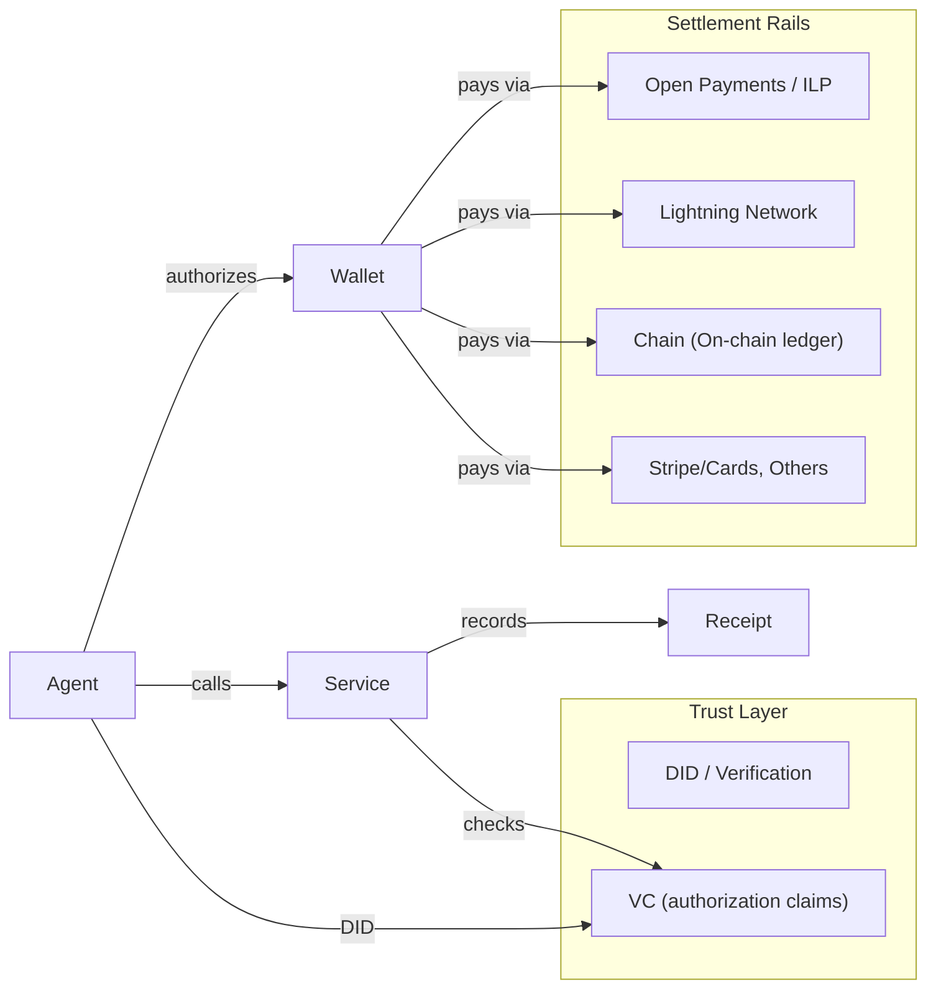
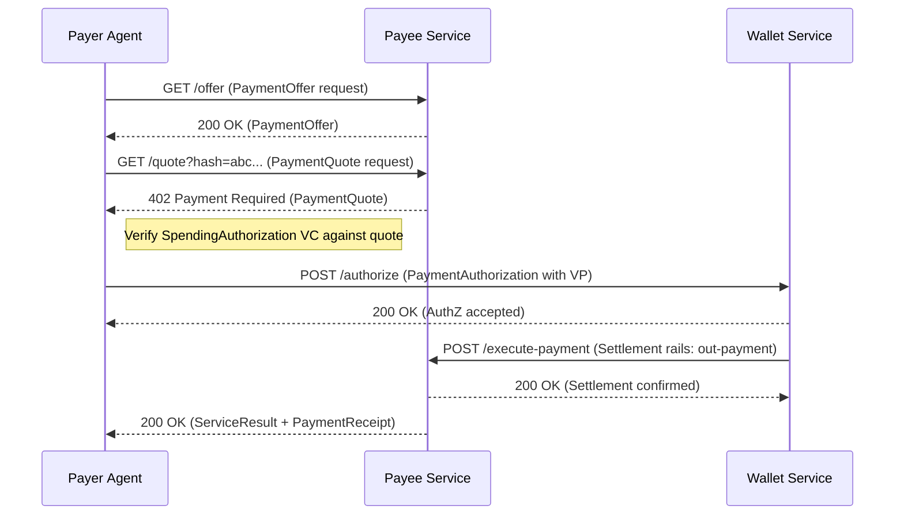
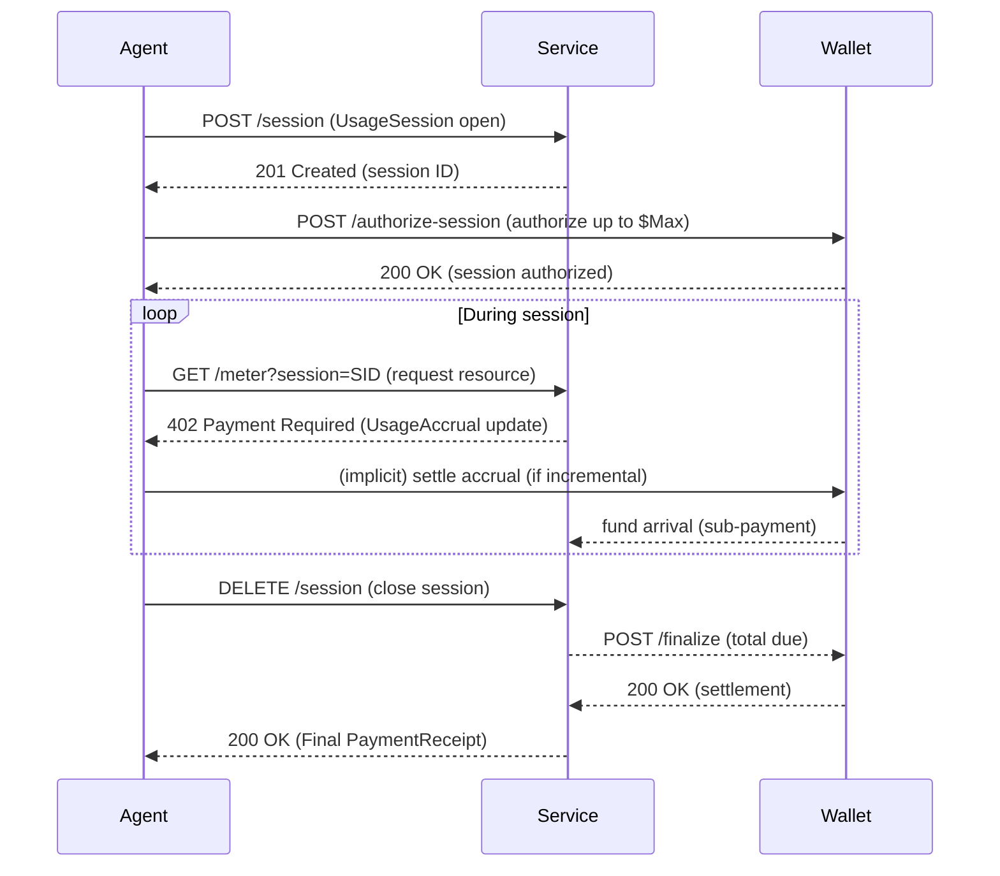

> [!WARNING]
> **Superseded background notes — not the specification.**
> This document is the original vision/whitepaper draft. The **normative,
> submission-candidate specification is now two peer documents** (W3C ReSpec):
> [Delegated Spending Authority](spec/authority/index.html) and
> [AVP-Micro Payments](spec/payments/index.html), with their JSON-LD contexts,
> JSON Schemas, SHACL shapes, and signed test vectors under [`spec/`](spec/)
> (start at [`spec/README.md`](spec/README.md)). Where this file and the `spec/`
> documents disagree, the `spec/` documents win. This file is retained only for
> historical/business context and is **not** maintained:
> - the bracketed `【NN†Lxx-Lyy】` markers throughout are stale citation
>   placeholders, not real references;
> - it predates several normative fixes (payee-signed quotes, economic-term
>   binding in `PaymentAuthorization`, verification-method binding,
>   `eddsa-jcs-2022` securing, `SessionBudgetAuthorization`, the
>   cumulative/incremental accrual model, `BitstringStatusList` revocation);
> - it uses the placeholder namespace `https://example.org/avp-micro/v1` and the
>   VC&nbsp;1.1 `issuanceDate` term, both replaced in the canonical spec.
>
> The PDF (`avp-micro.pdf`) is likewise an old export and should be regenerated
> from the `spec/` documents.

# Executive Summary

The rise of autonomous AI agents has exposed a **critical gap in online payments**. Agents need to make tiny, automated payments for compute, data, and services, but traditional rails (cards, bank transfers, wallets) were built for humans and do not support this use case【31†L59-L67】【24†L323-L331】.  Agents lack traditional identity (no passport, credit card) and must transact *programmatically*, often for micro-amounts that would be uneconomical under legacy fees【31†L59-L67】. Existing “micropayment” flows (e.g. Web Monetization, Interledger streams, Lightning Network, x402/HTTP 402, Stripe MPP) address parts of this problem, but they generally assume fixed trust models or closed ecosystems.  

**AVP-Micro** proposes to add a **DID+VC-based trust and authorization layer** on top of *any* settlement rail. This combines: (a) **portable identity** via Decentralized Identifiers (DIDs)【35†L245-L254】, (b) **verifiable delegation** via W3C Verifiable Credentials (VCs)【38†L58-L64】, and (c) **signed messages** (HTTP Message Signatures or DPoP) for integrity. The payment itself settles over pluggable rails (Open Payments/Interledger, Lightning, on-chain ledgers, Stripe/Cards, etc.). This separation cleanly solves: “Who is paying?” (DID), “Under what authority?” (VC), and “Did money actually move?” (settlement). The result is **machine-native micropayments** with fine-grained delegation, auditability, and interoperability【21†L75-L84】【21†L82-L90】.

---

# 1. Problem Statement

AI agents will soon be making countless automated purchases (APIs, data, compute) at micro-scale, but **current systems fail them**:

- **Human-centric flows.** Agents must today use OAuth2, API keys, or platform accounts to pay humans’ way, requiring complex setups (accounts, billing portals) that break agent autonomy【31†L59-L67】【24†L323-L331】. 
- **No portable identity.** Traditional payment systems tie identity to phone/email or corporate accounts. Agents have no such identity; and if we treat an agent like a user, we lose portability and sovereignty【21†L75-L84】【35†L245-L254】.  
- **Coarse authority.** Existing token-based delegation (OAuth2, API keys) is opaque and rigid. Agents need **fine-grained, verifiable spending policies** (caps, whitelisted merchants, time windows) that can be cryptographically enforced【21†L82-L90】【29†L149-L157】.  
- **Micropayments overhead.** Even optimized rails (ILP streams, LN, Web Monetization) assume a static user-wallet and have limited trust semantics. Plus, per-request human interaction is impractical (e.g. LN’s L402 protocol requires invoice handling)【31†L73-L81】【26†L183-L191】.  
- **Cross-domain trust.** Agents will use services across organizations. Without a universal identity/credential layer, each platform forces its own keys/permissions, leading to fragmentation and vendor lock-in【19†L75-L83】【29†L198-L207】.  

**Failure modes** include agents overspending, fraud (agents tricked by malicious payees), irrecoverable disputes (no audit trail), and platform lock-in.

# 2. State of the Art

Several trends and standards are emerging:

- **Open Payments (Interledger, GNAP).** The Interledger “Open Payments” initiative defines HTTP APIs (Payment Pointers, Quotes, Incoming/Outgoing Payments) to standardize account-to-account transfers (often via ILP)【19†L27-L35】【19†L75-L83】. It uses GNAP (Grant Negotiation and Authorization Protocol) for delegated account access【19†L75-L83】【18†L149-L158】, enabling fine-grained payment grants. Open Payments is currency- and rails-agnostic, assuming an ILP-connected global ledger【19†L27-L35】.  
- **Web Monetization (Interledger).** Streaming micropayments via ILP allow pay-as-you-go for content, automatically routing fractions of a cent to creators【18†L119-L128】. It uses the Open Payments GNAP grants for authorizing streams【18†L149-L158】.  
- **Lightning Network (HTTP 402 / L402).** Lightning Labs’ L402 protocol revives HTTP 402 “Payment Required” with a Lightning invoice and macaroon for authentication【31†L73-L81】. Tools like *lnget* let agents pay instantly over LN (no signup required), with scoped macaroons for delegated spend【31†L73-L81】【31†L123-L131】.  
- **Coinbase x402.** Similar to L402, Coinbase’s x402 spec uses HTTP 402 for stablecoin (EIP-3009) payments【21†L135-L143】. Agent requests get a 402/quote, the agent signs a token transfer, and the service processes it, all in one HTTP round-trip【21†L135-L143】【15†L107-L116】.  
- **Stripe MPP.** Stripe’s new Machine Payments Protocol (MPP) standardizes HTTP `402 Payment Required` with a `WWW-Authenticate: Payment` challenge【26†L183-L191】. It supports multiple rails (Stablecoins, Stripe cards, Lightning) and introduces *payment intents* (“charge” for one-time, “session” for streaming)【26†L211-L220】. MPP is essentially an HTTP framework for multi-method agent payments【26†L183-L191】【26†L213-L221】.  
- **OAuth2/DPOP/HTTP Signatures.** Existing auth protocols are being extended. The IETF’s OAuth DPoP draft (RFC 9449) binds tokens to client keys【44†L524-L533】, and HTTP Message Signatures (draft) allow requests to be signed end-to-end【42†L210-L219】. These provide non-replayable, sender-bound auth for API calls.  
- **DID and VC.** The W3C’s DID and Verifiable Credential standards offer *portable, cryptographic identity and claims*. DIDs allow agents to have global unique identifiers they control【35†L245-L254】. VCs let issuers make tamper-evident claims about an agent (e.g. spending limits, roles)【38†L58-L64】【21†L82-L90】. These standards underpin many agentic payment proposals (e.g. Google’s AP2【21†L75-L84】【21†L82-L90】, Universal Commerce Protocol【29†L149-L157】).

## Rationale for DID+VC Trust Layer

Building DID/VC on top of payment rails gives **robust, interoperable trust**. Key benefits:

- **Portable Identity.** Agents and services use DIDs, not platform-specific IDs, so identity is cross-domain【21†L75-L84】【35†L245-L254】.  
- **Verifiable Authorization.** Spending rights are expressed as VCs (“mandates” or “spending authorizations”) signed by the principal【21†L82-L90】【29†L149-L157】. The agent carries these VCs in requests. Any service or wallet can *cryptographically verify* the agent’s authority without custom integration.  
- **Fine-Grained Policies.** VCs can encode complex limits (per-transaction cap, daily limit, allowed payees/services)【21†L82-L90】【29†L149-L157】. They can also be revoked or updated on-chain if needed. This avoids giving agents full account keys or unlimited API tokens.  
- **Decentralized Trust.** Trust is not tied to a single vendor. Any issuer (corporate principal, bank, consortium) can issue credentials; any verifier can check them via DIDs【21†L75-L84】【29†L149-L157】. This aligns with open ecosystems like Open Payments/Interledger, preventing lock-in.  
- **Native Auditability.** Each payment request and credential usage is signed. This yields an auditable, machine-verifiable log of who authorized what. Regulators and compliance tools can leverage the same VC/DID infrastructure used elsewhere.  

Importantly, DID/VC is **orthogonal to the payment rail**. It does *not* replace value transfer. Instead, it standardizes *identity and policy*. For example, an agent with DID can present a VC credential as “spending authorization” while settling on ILP, Lightning, or Stripe. The credential tells the wallet/service how much the agent can spend and on which services. Once authorized, the actual payment goes through the chosen rail (see Fig. 1). In summary, the DID+VC layer handles **“who” and “under what terms”**, while the rail handles **“movement of money”**【21†L82-L90】【19†L75-L83】.

<!-- Possibly add Figure 1 (protocol stack) here if needed, but no images to embed. -->

---

# 3. Protocol Overview

AVP-Micro (Agent Verifiable Micropayments) defines the following components:

- **Roles:** Principal, Payer Agent, Payee Service, Wallet Service, (optional) Verifier/Auditor.  
- **Identifiers:** All entities (agents, services, wallets) are DIDs (e.g. `did:web:example.com:agent123`). DID Documents store public keys and endpoints【21†L75-L84】【35†L245-L254】.  
- **Credentials:** Standard VC profiles for (1) Spending Authorization, (2) Payment Capability, (3) Merchant/Service Credential. Each follows the W3C VC Data Model 2.0【38†L58-L64】 with JSON-LD.  
- **Messages/Resources:** JSON-LD objects (with DID-based IDs) for PaymentOffer, PaymentQuote, PaymentAuthorization, PaymentExecution, PaymentReceipt, UsageSession, UsageAccrual (for streaming). These are independent of transport and can be sent over HTTPS, message buses, or any secure channel.  
- **Workflows:** *(a)* One-off payment: Discover → Quote → Authorize → Settle → Deliver → Receipt. *(b)* Session/streaming mode: Session Open → Usage Accrual (loop) → Final Settlement + Receipt. Sequence diagrams (Mermaid) illustrate both.  
- **Security:** All messages are signed. We recommend HTTP Message Signatures (IETF) or OAuth DPoP for integrity and replay-protection【42†L210-L219】【44†L524-L533】. Each message carries a nonce/timestamp/expiry binding it to the exact request. DID resolution and VC signature checks ensure authenticity.  
- **Policy:** The Wallet Service enforces constraints from the SpendingAuthorization VC (caps, whitelists, etc.) before executing payment. Nonces and timestamps prevent replay. Issuers and revocation status are checked via DID methods or credential status lists.  
- **Errors:** Defined machine-readable error codes (e.g. `invalidSignature`, `quoteExpired`, `policyViolation`, etc.) with human-readable descriptions.  
- **Audit & Logging:** Each step produces cryptographically-signed evidence. Wallets and services should keep append-only logs of offers, quotes, authorizations, settlements, and receipts for reconciliation.  
- **Privacy:** Only necessary data is revealed. For example, agents can use *selective disclosure* in VCs or even ZK proofs for credentials if desired. The protocol supports credential presentation without leaking extra info (e.g. using pairwise DIDs or zero-knowledge options).  
- **Interoperability:** By using DIDs/VCs and standard JSON-LD, AVP-Micro is interoperable across implementations. It anticipates extension: new credential types (e.g. loyalty tokens), new pricing models (subscription, tiered), or new rails can be added without breaking core flows.  

Figure 1 (below) shows the architecture:


*Figure 1. AVP-Micro separates the **Trust Layer** (DID identity, VC policies) from the **Settlement Layer** (Open Payments/ILP, Lightning, on-chain, card networks). Payments execute via any chosen rail, while DID/VC ensures secure, auditable authorization【21†L82-L90】【19†L75-L83】.*

---

# 4. Roles and Identifiers

- **Principal:** Human or organization owning funds. This party issues SpendingAuthorization VCs to its agents. Identified by a DID (e.g. `did:example:AliceCorp`).
- **Payer Agent:** Autonomous agent acting on Principal’s behalf. Holds a DID (e.g. `did:example:alice-bot1`). The agent (or its wallet) keeps the private key for its DID.
- **Payee Service (or Merchant):** The service receiving payment (e.g. a model API, data provider). Has a DID (e.g. `did:web:apis.com:ml-model`). May also have a VC from a “trust anchor” attesting its legitimacy (MerchantCredential).
- **Wallet Service:** A service or module (could be custodian, Smart Contract, or on-device wallet) that actually holds funds and executes settlement on the chosen rail. It is controlled by the Payer principal. It also has a DID and keys.
- **Verifier/Auditor:** Any entity (e.g. compliance monitor) that later verifies the chain of signatures, credentials, and receipts.  

Each DID must resolve to a **DID Document** (JSON-LD) containing:
- Public verification keys (at least one Ed25519 or secp256k1 key).  
- Service endpoints (e.g. HTTPS endpoints for payment quotes, receipt submission, credential status).  
- Optionally, a “wallet service endpoint” (for incoming/outgoing payment APIs) and “credential status endpoint.”  

Example (simplified) DID Document entries:
```json
{
  "@context": "https://www.w3.org/ns/did/v1",
  "id": "did:example:buyer-01",
  "verificationMethod": [{
    "id": "did:example:buyer-01#keys-1",
    "type": "Multikey",
    "controller": "did:example:buyer-01",
    "publicKeyMultibase": "z6Mki..."
  }],
  "service": [{
    "id": "did:example:buyer-01#wallet-service",
    "type": "WalletService",
    "serviceEndpoint": "https://wallet.example.com/api"
  }]
}
```
*Any DID method is acceptable (did:web, did:key, did:ion, etc.), as long as it can be resolved to keys and endpoints. The DID layer is independent of the settlement choice.*

---

# 5. Credential Profiles

AVP-Micro uses JSON-LD/VC 2.0 credentials (issuer, issuanceDate, type, credentialSubject, proof). Key credential types:

## 5.1 Spending Authorization Credential

Issued by the **Principal** to the **Payer Agent**. It delegates spending power to the agent.

**Context:** `https://www.w3.org/ns/credentials/v2`, custom “SpendingAuthorization” vocabulary.  
**Types:** `["VerifiableCredential","SpendingAuthorizationCredential"]`.  

**Claims (Credential Subject):**  
- `id`: the agent’s DID.  
- `currency` (string): allowed currency (e.g. "USD").  
- `maxPerTransaction` (decimal/string): maximum amount per payment.  
- `dailyLimit` (decimal): total daily spend cap.  
- `allowedPayees` (array of DIDs or strings): whitelist of service DIDs or categories.  
- `validFrom`/`validUntil` (dates, optional): validity window.  
- `requiresApprovalAbove` (decimal, optional): if a payment exceeds this, agent must prompt for human approval.  
- (Optional) `allowedServiceTypes`: service-category IRIs, e.g. `cat:ComputeService`, `cat:DataProvider`.

**Example:**  
```json
{
  "@context": ["https://www.w3.org/ns/credentials/v2","https://example.org/avp-micro/v1"],
  "id": "urn:avp:vc:spendauth:456",
  "type": ["VerifiableCredential","SpendingAuthorizationCredential"],
  "issuer": "did:example:org123",
  "issuanceDate": "2026-03-25T20:00:00Z",
  "credentialSubject": {
    "id": "did:example:agent:maintenance-bot-01",
    "currency": "USD",
    "maxPerTransaction": "0.05",
    "dailyLimit": "5.00",
    "allowedPayees": ["did:example:services:hvac-api"],
    "allowedServiceTypes": ["HVACControlService"]
  },
  "proof": { /* cryptographic signature by issuer */ }
}
```
*(This VC states that agent `maintenance-bot-01` can spend up to \$0.05 per call, \$5/day, only on the `hvac-api` service.)*  

The **Wallet Service** verifies this credential before any payment: it checks the issuer’s DID, signature, expiration, and that the requested payee/amount fit the constraints【21†L82-L90】【29†L149-L157】.

## 5.2 Payment Capability Credential

Issued by the **Wallet Provider** or **Bank**. Binds the agent’s DID to an account or wallet address. This credential proves the agent has a valid payment source.

**Types:** `["VerifiableCredential","PaymentCapabilityCredential"]`.  

**Claims:**  
- `id`: agent’s DID.  
- `account`: account identifier or wallet address (could be a Payment Pointer URL, blockchain address, etc.).  
- `currency` and `asset` (string): e.g. "USD" or token symbol.  
- (Optional) `assetScale` (integer): decimals.  
- (Optional) `expires`: validity (e.g. for a temporary escrow).  

**Example:**  
```json
{
  "@context": ["https://www.w3.org/ns/credentials/v2","https://example.org/avp-micro/v1"],
  "id": "urn:avp:vc:paycap:001",
  "type": ["VerifiableCredential","PaymentCapabilityCredential"],
  "issuer": "did:example:bank",
  "issuanceDate": "2026-03-25T20:05:00Z",
  "credentialSubject": {
    "id": "did:example:agent:maintenance-bot-01",
    "account": "https://bank.example.com/alice-wallet",
    "currency": "USD",
    "assetScale": 2
  },
  "proof": { /* signed by bank */ }
}
```
*(This asserts that `maintenance-bot-01` can pay using the specified USD account.)*  

## 5.3 Merchant (Service) Credential

(Optional, but recommended) Issued by a **Trust Anchor** (e.g. industry group, authority) to the Payee Service. Lets agents verify that a service is legitimate.

**Types:** `["VerifiableCredential","MerchantCredential"]`.  

**Claims:**  
- `id`: service’s DID.  
- `merchantName` or `companyName` (string).  
- `categories`: list of service categories (e.g. "MLInferenceService", "GeoDataProvider").  
- `validUntil` (optional).  

**Example:**  
```json
{
  "@context": ["https://www.w3.org/ns/credentials/v2","https://example.org/avp-micro/v1"],
  "id": "urn:avp:vc:merchant:802",
  "type": ["VerifiableCredential","MerchantCredential"],
  "issuer": "did:example:trust-registry",
  "issuanceDate": "2026-01-01T00:00:00Z",
  "credentialSubject": {
    "id": "did:example:services:geospatial-data",
    "merchantName": "GeoData Inc.",
    "categories": ["GeoDataProvider"]
  },
  "proof": { /* signed by trust registry */ }
}
```
*(Here, a “trust registry” vouches that `geospatial-data` service is a verified GeoDataProvider.)*  

**Note:** All credentials follow the VC Data Model 2.0; verifiable presentations (VPs) of credentials are used in requests when needed【38†L58-L64】.  Selective disclosure and status checks (e.g. OCSP, revocation lists) should be supported.

---

# 6. Message and Resource Models

All protocol messages are JSON-LD objects. They include:
- `@context`: JSON-LD contexts for VC and custom terms.  
- `id` (URI or URN): unique ID of the message object.  
- `type`: one or more types (e.g. `PaymentQuote`).  
- Timestamps: `created` or `issuanceDate`, `expires` fields.  
- `from`/`to` or `payer`/`payee` fields with DIDs.  
- `proof`: cryptographic signature object (or linked VC presentation).  

Below are the core resources. For each, we list fields, types, requirements, and an example instance.

## 6.1 PaymentOffer

- **Purpose:** Service advertises pricing and terms (an “offer”).  
- **Flow:** Payee may publish or serve this at a well-known endpoint. The payer discovers it (e.g. via DID service endpoint or API).  

**Fields:**  
- `id` (URI, required): Offer identifier (URN/URL).  
- `type`=`["PaymentOffer"]` (required).  
- `payee` (string, required): Payee DID.  
- `pricingModel` (object, required): Describes pricing, e.g. 
  ```json
    {
      "type": "PerCall",
      "amount": "0.001",
      "currency": "USD"
    }
  ```
- `acceptedSettlementMethods` (array of strings, optional): e.g. `["open-payments","lightning","stripe"]`.  
- `acceptedCredentialIssuers` (array of DIDs, optional): whose VCs are accepted.  
- `quoteEndpoint` (URL, required): Endpoint to request a PaymentQuote.  
- `offerValidity` (datetime, optional): until when this offer is valid.  

**Example:**  
```json
{
  "@context": ["https://www.w3.org/ns/credentials/v2","https://example.org/avp-micro/v1"],
  "id": "urn:avp:offer:tool-api:123",
  "type": "PaymentOffer",
  "payee": "did:web:provider.com:services:tool-api",
  "pricingModel": {
    "type": "PerCall",
    "amount": "0.001",
    "currency": "USD"
  },
  "acceptedSettlementMethods": ["open-payments","internal-ledger"],
  "acceptedCredentialIssuers": ["did:web:example.com:org"],
  "quoteEndpoint": "https://provider.com/payments/quotes",
  "offerValidity": "2026-04-01T00:00:00Z"
}
```
*(This offer says the service charges USD 0.001 per call, via OpenPayments or internal ledger, and can quote at the given endpoint.)*

## 6.2 PaymentQuote

- **Purpose:** Service returns a specific price quote for a particular request (one-time use, short-lived).  
- **Flow:** Payer requests a quote (e.g. POST to `quoteEndpoint`) with details like the planned service call (hash, parameters). Service responds with a JSON quote.

**Fields:**  
- `id` (URI, required): Quote ID.  
- `type`=`["PaymentQuote"]` (required).  
- `payer` (string, required): Payer’s DID.  
- `payee` (string, required): Payee’s DID.  
- `serviceRequestHash` (string, required): Hash of the service request (to bind quote to request).  
- `amount` (decimal string, required): Amount to pay.  
- `currency` (string, required): Currency code.  
- `settlementMethod` (string, required): e.g. `"open-payments"`.  
- `settlementTarget` (string, required): e.g. wallet or payment pointer URL (where to send funds).  
- `expires` (datetime, required): Quote expiry.  
- *(Optional pricing details: e.g. `pricingModel`, in case breakdown needed.)*

**Example:**  
```json
{
  "@context": ["https://example.org/avp-micro/v1"],
  "id": "urn:avp:quote:789",
  "type": "PaymentQuote",
  "payer": "did:web:example.com:agents:buyer-01",
  "payee": "did:web:provider.com:services:tool-api",
  "serviceRequestHash": "sha256-abc123...", 
  "amount": "0.001",
  "currency": "USD",
  "expires": "2026-03-25T21:35:00Z",
  "settlementMethod": "open-payments",
  "settlementTarget": "https://wallet.example.com/alice-addr"
}
```
*(This quote says Agent `buyer-01` owes USD 0.001 to `tool-api`, via Open-Payments, payable to Alice’s wallet.)*

## 6.3 PaymentAuthorization

- **Purpose:** Payer (agent) authorizes the payment after accepting the quote, including proofs of intent and authority.  
- **Flow:** Agent sends this (signed message) to the Payee (or Wallet service) to initiate settlement.

**Fields:**  
- `id` (URI, required): Auth ID.  
- `type`=`["PaymentAuthorization"]`.  
- `quote` (URI, required): Reference to the PaymentQuote ID being accepted.  
- `payer` (DID, required).  
- `payee` (DID, required).  
- `timestamp` (datetime, required): issuance time.  
- `expires` (datetime, required): short validity (e.g. 1 minute) to prevent reuse.  
- `nonce` (string, required): random nonce.  
- `requestHash` (string, required): hash of the intended service call payload (must match quote’s context).  
- `vp` (VerifiablePresentation, required): Presentation containing the SpendingAuthorization VC (and optionally PaymentCapability VC or Merchant VC). For simplicity, shown as nested:
```json
"vp": {
  "type": "VerifiablePresentation",
  "verifiableCredential": [ /* array of credentials (JSON-LD) */ ]
}
```
- `proof` (signature): Signature by the payer over the entire authorization object (including the VP content).

**Example:** (Note: actual VP content omitted for brevity)  
```json
{
  "@context": ["https://example.org/avp-micro/v1"],
  "id": "urn:avp:authz:999",
  "type": "PaymentAuthorization",
  "quote": "urn:avp:quote:789",
  "payer": "did:web:example.com:agents:buyer-01",
  "payee": "did:web:provider.com:services:tool-api",
  "timestamp": "2026-03-25T21:30:02Z",
  "expires": "2026-03-25T21:31:02Z",
  "nonce": "n-39102",
  "requestHash": "sha256-abc123...", 
  "vp": {
    "type": "VerifiablePresentation",
    "verifiableCredential": [
      /* SpendingAuthorization VC JSON */
    ]
  },
  "proof": { /* signature by buyer-01's key */ }
}
```
*This binds the agent’s payment intent to the quote and includes the signed delegation credential (SpendingAuthorization) in the presentation.* The service or wallet verifies the proof and the VP’s credentials (issuer, schema, etc.) before proceeding.

## 6.4 PaymentExecution

- **Purpose:** Outcome of executing the payment on the settlement rail. Created by the Wallet Service.  
- **Flow:** After the wallet actually transfers funds, it returns a PaymentExecution object to the agent and/or payee.

**Fields:**  
- `id` (URI, required).  
- `type`=`["PaymentExecution"]`.  
- `authorization` (URI, optional): ID of the PaymentAuthorization that triggered this execution.  
- `amount` (decimal, required): Amount sent.  
- `currency` (string).  
- `status` (string, required): e.g. `"completed"`, `"failed"`.  
- `settlementRef` (string): Reference to the underlying transaction (e.g. transaction ID or outgoing payment URL).  
- `timestamp` (datetime): when executed.  

**Example:**  
```json
{
  "@context": ["https://example.org/avp-micro/v1"],
  "id": "urn:avp:exec:555",
  "type": "PaymentExecution",
  "authorization": "urn:avp:authz:999",
  "amount": "0.001",
  "currency": "USD",
  "status": "completed",
  "settlementRef": "open-payments://outgoing-payment/abc123",
  "timestamp": "2026-03-25T21:30:03Z"
}
```
*(Indicates the wallet sent USD 0.001 on chain or via interledger, completing the payment.)*

## 6.5 PaymentReceipt

- **Purpose:** Proof by the Payee that service was delivered for payment. Contains what was provided (e.g. data hash) and links to the payment. Issued by the Payee.  
- **Flow:** Payee issues this after verifying settlement, possibly in the same HTTP response as the service result.

**Fields:**  
- `id` (URI, required).  
- `type`=`["PaymentReceipt"]`.  
- `quote` (URI, required): the original quote ID.  
- `execution` (URI): reference to the PaymentExecution (if available).  
- `payer` (DID), `payee` (DID).  
- `amount` (decimal, required), `currency`.  
- `serviceOutputHash` (string): e.g. hash of the resource/data returned.  
- `fulfilledAt` (datetime): time of delivery.  

**Example:**  
```json
{
  "@context": ["https://example.org/avp-micro/v1"],
  "id": "urn:avp:receipt:222",
  "type": "PaymentReceipt",
  "quote": "urn:avp:quote:789",
  "execution": "urn:avp:exec:555",
  "payer": "did:web:example.com:agents:buyer-01",
  "payee": "did:web:provider.com:services:tool-api",
  "amount": "0.001",
  "currency": "USD",
  "serviceOutputHash": "sha256-def456...",
  "fulfilledAt": "2026-03-25T21:30:05Z"
}
```
*(This receipt confirms that `tool-api` delivered the result (hash `def456`) after receiving payment.)* The receipt can itself be signed by the Payee for non-repudiation. Optionally, it could be issued as a VerifiableCredential of type `PaymentReceipt`.

## 6.6 UsageSession (for streaming)

- **Purpose:** Establish a payment session for continuous usage.  
- **Flow:** Payer opens a session with a one-time authorization (like reserving a budget). Then usage is metered.

**Fields:**  
- `id` (URI, required).  
- `type`=`["UsageSession"]`.  
- `payer` (DID), `payee` (DID).  
- `currency`, `maxAmount` (decimal): total budget approved.  
- `startingBalance` (decimal): pre-funded amount (optional).  
- `expires` (datetime): session expiry.  
- `timestamp` (datetime): session start.  

**Example:**  
```json
{
  "@context": ["https://example.org/avp-micro/v1"],
  "id": "urn:avp:session:001",
  "type": "UsageSession",
  "payer": "did:example:agent:streamer1",
  "payee": "did:example:services:realtime-sensor",
  "currency": "USD",
  "maxAmount": "0.50",
  "startingBalance": "0.50",
  "timestamp": "2026-03-25T21:40:00Z",
  "expires": "2026-03-25T22:00:00Z"
}
```
*(Agent opens a session with a \$0.50 budget, expiring in 20 minutes.)*

## 6.7 UsageAccrual

- **Purpose:** Incremental report of usage and charges during a session.  
- **Flow:** Payee periodically (or at end) issues accrual updates to the wallet or agent.

**Fields:**  
- `id` (URI).  
- `type`=`["UsageAccrual"]`.  
- `session` (URI, required): the UsageSession ID.  
- `meterReading` (string/number): e.g. tokens used or units consumed.  
- `amountAccrued` (decimal): cost since last update (or total so far).  
- `currency`.  
- `timestamp` (datetime).  

**Example:**  
```json
{
  "@context": ["https://example.org/avp-micro/v1"],
  "id": "urn:avp:usage:123",
  "type": "UsageAccrual",
  "session": "urn:avp:session:001",
  "meterReading": "1500",
  "amountAccrued": "0.015",
  "currency": "USD",
  "timestamp": "2026-03-25T21:45:00Z"
}
```
*(After 1500 units, \$0.015 is due.)* The wallet can either settle incrementally on each accrual (if rail allows) or wait until session end. Final settlement uses the sum of all accruals.

## 6.8 Summary of Fields

Below is a summary of key fields used across resources (types in **BOLD**, `*` required):

| Field           | Type                    | Required? | Description                                                  |
|-----------------|-------------------------|----------|--------------------------------------------------------------|
| `id`            | URI (string)            | *        | Identifier of the resource.                                  |
| `type`          | string or array         | *        | Resource type(s) (e.g. PaymentQuote).                       |
| `payer`         | DID string              | Varies   | DID of payer agent.                                          |
| `payee`         | DID string              | Varies   | DID of payee/service.                                       |
| `amount`        | decimal string          | * (in quotes) | Payment amount.                                               |
| `currency`      | string (ISO code)       | Varies   | Currency code, e.g. "USD".                                   |
| `expires`       | datetime (ISO 8601)     | Conditionally* | Expiry of quote or session.                                  |
| `timestamp`     | datetime (ISO 8601)     | * (sometimes) | Time of creation.                                             |
| `nonce`         | string                  | * (in AuthZ) | Random nonce for replay protection.                           |
| `requestHash`   | string (hash)           | * (in AuthZ) | Hash of the original service request for binding.             |
| `quote`         | URI                     | * (in AuthZ, Receipt) | Reference to a PaymentQuote.                                |
| `authorization` | URI                     | (in Execution) | Reference to PaymentAuthorization.                          |
| `execution`     | URI                     | (in Receipt) | Reference to PaymentExecution.                              |
| `vp`            | VerifiablePresentation  | (in AuthZ) | Container for one or more VCs.                              |
| `proof`         | object (JSON)           | * (for signatures) | Cryptographic signature object (e.g. HTTP Sig, JWS).         |
| `serviceOutputHash` | string (hash)       | (in Receipt) | Hash of delivered data/output.                              |

*Fields marked Varies or conditional depend on the message type.  All amount and currency fields should match units of settlement.*

---

# 7. Protocol Workflows

The AVP-Micro flows are transport-agnostic but typically occur over HTTPS or agent-to-agent messaging. Below we outline the standard **payment flow** and a **streaming (session) flow**. Each step’s message type is indicated.

## 7.1 One-off Payment Flow


*Figure 2. One-off payment flow. Agent discovers the offer, requests a quote, then submits a signed authorization (with VCs) to the wallet. After funds move on the chosen rail, the service delivers the resource plus a signed receipt.* 

**Step details:**  
1. **Discover Offer:** Agent resolves payee’s DID Document, finds `quoteEndpoint`, and GETs the PaymentOffer.  
2. **Request Quote:** Agent computes a hash of the intended request and asks `GET /quote`. The service replies with a PaymentQuote (HTTP 402 or 200 with JSON).  
3. **Verify Policy:** Agent ensures the quote’s `amount`, `payee`, etc. comply with its SpendingAuthorization VC. If not, abort.  
4. **Authorize Payment:** Agent constructs a PaymentAuthorization message: it includes the quote ID, timestamps, nonce, and a VerifiablePresentation containing its SpendingAuthorization VC (and others if needed). Agent signs this message with its DID key and sends to Wallet (or directly to Service if the service mediates wallet).  
5. **Execute Settlement:** The Wallet service (trusted by the Principal) verifies the signature, DID, and VCs. If policy allows, it instructs the settlement rail (Open Payments, LN, etc.) to transfer the quoted amount from payer to payee.  
6. **Deliver Service:** Upon settlement confirmation, the Payee executes the requested service.  
7. **Receipt:** Payee issues a PaymentReceipt, binding the quote and settlement reference to the delivered output (data hash). This receipt is signed by the Payee. It can be returned in the HTTP response or a follow-up message.  

By the end, the agent has a verifiable record of: (a) its authorization (signed by its DID), (b) the settlement execution, and (c) a receipt (signed by the payee). This chain of signed artifacts can be audited later.

## 7.2 Session/Streaming Payment Flow

For high-frequency or continuous usage, a single round-trip per micro-unit is inefficient. AVP-Micro supports a **streaming mode** via session credentials:


*Figure 3. Streaming/session payment flow. The agent opens a `UsageSession` with a budget. The service periodically reports `UsageAccrual` (meter readings and partial charges). Payments can be made incrementally or at session end. Finally, a consolidated receipt is issued.*  

**Step details:**  
1. **Open Session:** Agent requests a UsageSession (includes max budget). Service returns a session ID.  
2. **Authorize Budget:** Agent (via wallet) authorizes the total budget. This can be done via a special PaymentAuthorization or by locking funds.  
3. **Metered Usage:** Agent repeatedly queries or streams data. Each time, Service responds with a UsageAccrual (HTTP 402 style) containing the usage and incremental charge.  
4. **Incremental Settlement:** Optionally, the agent can have the wallet settle each accrual immediately (to simplify accounting). Alternatively, accruals are just signed updates and only settled at session close.  
5. **Close Session:** Agent signals end. Service computes final charge (sum of accruals). Wallet settles the final payment (taking into account any pre-paid).  
6. **Final Receipt:** Service issues a final PaymentReceipt for the total usage and ends the session.

This pattern is suitable for streaming APIs (per-token usage), sensor feeds, or any metered resource. It avoids repeated quote/authorize overhead for each micro-transaction. It parallels ideas in Web Monetization (streams) and the “session” intent in Stripe MPP【26†L213-L221】.

---

# 8. Security and Integrity

AVP-Micro enforces security via **signatures**, **proof-of-possession**, and **replay protection**:

- **Signed Messages:** Every request and resource (Offer, Quote, Authorization, Execution, Receipt) must be signed by the sender’s DID key. We recommend HTTP Message Signatures (IETF draft) or DPoP (IETF 9449) in REST APIs【42†L210-L219】【44†L524-L533】. For example, the PaymentAuthorization can be sent as a signed JWS payload or using the `Signature` header.  
- **Proof-of-Possession:** The agent proves control of its DID’s private key with each request. DPoP-like proofs bind the request to the key; message signatures inherently do too【44†L524-L533】【42†L210-L219】.  
- **Binding Fields:** Authorizations include `nonce`, `timestamp`, and `expires` to prevent replay. The `requestHash` ties the auth to the exact service call. Any change in payload breaks the binding.  
- **Credential Verification:** Issuers’ DIDs are trusted by the wallet/service. For each VC in the VP, the verifier checks:
  - Issuer’s signature and DID (resolves DID Document to obtain key).  
  - Credential schema (type, context) matches expectation (SpendingAuthorization, etc.).  
  - `credentialSubject.id` matches the agent’s DID.  
  - All limits in the credential are satisfied by the request (amount ≤ maxPerTransaction, payee allowed, etc.)【21†L82-L90】【29†L149-L157】.  
  - Credential validity period (now between `validFrom` and `validUntil`).  
  - Revocation status (if status list or blockchain anchoring is used).  
- **Key Management:** Agents should not expose private keys to other processes. A recommended pattern is to store agent keys in a secure enclave or separate process. Wallet services often act as custodians (so the agent only sends signed commands to the wallet, never raw keys).  
- **Cross-Origin Protection:** If using web APIs, CORS or DMZ controls should prevent other domains from injecting or reading payment messages. Always use TLS.  
- **Auditable Nonces:** Nonces must be unique per channel. Verifiers keep a short cache of recent nonces to block duplicates【42†L210-L219】.

**Secure Bindings:** 
- The `quoteID` and `requestHash` in PaymentAuthorization ensure the agent can’t trick the service with a stale or tampered quote.  
- The `settlementRef` in PaymentExecution ties back to the actual ledger tx.  
- The `serviceOutputHash` in Receipt ties payment to delivered content.  

These cryptographic bindings and signatures yield **non-repudiation** and prevent misuse. For example, if an agent’s SpendingAuthorization VC did not allow “hammer-bot.com” as a payee, the wallet would refuse that payment. If a malicious site tried to replay an old PaymentAuthorization, the nonce/expiry check blocks it.

---

# 9. Policy Enforcement and Wallet Behavior

Before executing a payment, the **Wallet Service** must enforce all relevant policies. At minimum, it should check:

- **Quote Validity:** Ensure the PaymentQuote is not expired, and its `payer` matches the agent DID requesting.  
- **Credential Match:** The `payer` DID in PaymentAuthorization equals the VC subject. Verify VC is unexpired, issuer is trusted, and signature is valid.  
- **Payee Whitelist:** The `payee` DID must be in `allowedPayees`, or its service category must be in `allowedServiceTypes`.  
- **Amount Limits:** `amount` ≤ `maxPerTransaction`, and (if tracking) sum of today’s spend + `amount` ≤ `dailyLimit`.  
- **Currency:** Matches `currency` in VC.  
- **Request Binding:** The `requestHash` in auth must equal the quote’s hash of the payload.  
- **Nonce & Timestamp:** `timestamp` must be recent; `nonce` not seen before.  
- **Settlement Method:** Wallet should only use approved rails (e.g. “open-payments”) as per the offer and quote.  
- **PaymentCapability:** (If used) Check the agent has a valid account credential and positive balance / credit.  

If any check fails, the wallet returns an error (see Section 12). This prevents an agent from over-spending or paying the wrong service. Only after *all* checks pass does the wallet initiate the transfer on the chosen rail.

During **streaming sessions**, the wallet also tracks cumulative charges. It should refuse if a new accrual would exceed `maxAmount`. It should honor any early termination requests and settle the final due amount.

**Failure Handling:** 
- If settlement fails (insufficient funds, network error), the wallet should return a `settlementFailed` error to the agent and service.  
- Payee can use partial payments (e.g. in USD with streaming micropayments): if only a portion arrives, it updates the PaymentExecution accordingly.  

---

# 10. Error Model

AVP-Micro defines machine-readable error codes and descriptions. Examples:

| Code                 | Description                                  |
|----------------------|----------------------------------------------|
| `invalidDid`         | The provided DID could not be resolved or was malformed. |
| `invalidSignature`   | A message or VC signature verification failed. |
| `credentialRejected` | A presented VC was not accepted (unknown issuer, expired, malformed). |
| `quoteExpired`       | The requested quote has expired. |
| `policyViolation`    | Spending policy (VC) constraints violated (limit exceeded, payee not allowed, etc.). |
| `insufficientFunds`  | The wallet reports not enough balance/credit for payment. |
| `settlementFailed`   | The on-chain or payment-rail transfer failed. |
| `nonceReuse`         | The nonce in a message was already used or missing. |
| `badRequest`         | General formatting or missing field error. |
| `serviceError`       | Payee encountered an internal error fulfilling the service. |

Each error response should be JSON with fields `code`, `description`, and optionally `details`. For example:
```json
{ 
  "code": "policyViolation", 
  "description": "Transaction exceeds per-call limit of $0.05", 
  "details": {"limit": "0.05", "attempted": "0.10"}
}
```
This allows the agent or wallet to handle errors programmatically (e.g. pause, seek user approval, or pick a cheaper service).

---

# 11. Audit, Logging, and Reconciliation

To support accountability and debugging, parties should log all critical steps:

- **Append-only Logs:** Wallets and services should maintain immutable logs of PaymentOffers published, PaymentQuotes issued, PaymentAuthorizations received, PaymentExecutions executed, and PaymentReceipts generated. Include timestamps and involved DIDs. Blockchain or append-only databases (e.g. TigerBeetle) are good backends.
- **Verifiable Evidence:** Where possible, store the actual signed JSON messages (or proofs of them). Since each object is self-contained with cryptographic proof, logs of the JSON suffice as audit evidence.
- **Reconciliation:** In batch, principals can verify that sums of PaymentExecutions match expected outflows and receipts match inflows. Having PaymentExecution IDs (from rails) makes this cross-checkable with bank/ledger statements.
- **Receipts as Proof:** Because receipts can be expressed as VerifiableCredentials, a payer or auditor can present these to third parties (e.g. regulators, accountants) to prove an agent’s expenditure and the service delivered, without revealing extraneous data【38†L58-L64】.
- **Credential Revocation:** If a SpendingAuthorization VC is revoked (user withdraws agent’s rights), that revocation should be captured in credential status lists or on-chain. Auditors can then flag any payments after revocation time.
- **Metrics:** Log useful metadata (latencies, negotiation failures) for performance tuning. But avoid logging sensitive data (like raw tokens).

Overall, the DID/VC approach means **every payment is self-describing and verifiable**, enabling strong post-hoc analysis.

---

# 12. Privacy Considerations

AVP-Micro is designed to minimize unnecessary data exposure:

- **Minimal Disclosure:** Agents include only the VCs needed. For instance, if only a spending limit is needed, the VC can omit personal identity claims. W3C VCs support selective disclosure (to some extent)【29†L90-L99】.
- **Zero-Knowledge (Future):** The protocol allows optional use of ZKPs as per AP2 or UCP architectures【29†L90-L99】. For example, an agent might prove “balance ≥ $10” without revealing account details. This is an advanced extension (beyond base spec) for maximum privacy.
- **Payment Detail Privacy:** The payment itself (via rails) may reveal minimal info. For example, Open Payments via ILP hides payer identities behind pointers. On-chain payments (e.g. Lightning) can be pseudonymous (macaroons hide identity)【31†L73-L81】. 
- **Credential Privacy:** If using did:key or pairwise DIDs, even the credential issuance context can be kept out-of-band. Sensitive attributes (like user identity) should not appear in the spending VCs; agents operate on behalf of the principal without revealing user PII.
- **Anonymity Not Assumed:** Note, however, that DID resolution and VC issuance can be linked by timing. For highly sensitive scenarios, agents could use rotating DIDs or ZKPs.  

The design encourages **privacy by default**: agents present only the proofs needed for each payment. The payee learns that “an authorized agent paid me X USD”, but not necessarily *which user* or all of the agent’s internal context.

---

# 13. Settlement Rails Comparison

The actual **settlement** (movement of value) can use various rails. Below is a summary comparing four example rails on key metrics:

| **Rail**             | **Cost per Tx**               | **Latency**              | **Privacy**                        | **Programmability**         |
|----------------------|-------------------------------|--------------------------|------------------------------------|----------------------------|
| Internal Ledger      | **Negligible.** Intra-entity | **Near-zero.** Instant.  | **High.** Within same system.      | **Limited.** Typically no cross-border. |
| Open Payments/ILP    | Very low (setup fee, then per-payment ILP fees) | **Low.** Typically <1s. ILP routing (~ms). | **Moderate.** Payment Pointer obscures account identity from payer. | **High.** Fine-grained API (quotes, pointers)【19†L27-L35】. Multi-currency. |
| Blockchain (Lightning)| Very low (sats per HTLC)     | **Low.** Sub-second for LN channels. On-chain finalization slower. | **Moderate.** Pseudonymous (on-chain addresses). Macaroons obfuscate identity. | **High.** Programmable scripts (LN channels, smart contracts). |
| Blockchain (On-chain)| High (gas fees). Not micropay friendly. | **High.** Seconds to minutes (block confirmation). | **Low.** Public ledger (though address is pseudonymous). | **High.** Smart contracts allow complex logic. |
| Stripe-like (Cards)  | **High.** ~2.9% + fixed fee, *per txn*. Huge for micro-payments. | **Low.** Authorize ~100ms, settle days. | **Moderate.** Bank-level, but traceable by issuer. | **Medium.** APIs for payments/subscriptions (less flexible for agents). |

<div class="mermaid">
flowchart LR
    style table fill:#f9f,stroke:#333,stroke-width:1px
    Table["Settlement Rail Comparison"]:::table
    Table -->|Internal ledger| IL
    Table -->|Open Payments (ILP)| OP
    Table -->|Lightning Network (L402)| LN
    Table -->|Stripe/Cards| SC
    classDef table fill:#f9f,stroke:#333,stroke-width:2px;
    classDef IL fill:#dfd;
    classDef OP fill:#ddf;
    classDef LN fill:#dff;
    classDef SC fill:#fdd;
    Table:::table
</div>

*Table 1.* **Settlement rails trade-offs.** Internal ledgers are cheapest and private but non-interoperable. Open Payments (Interledger) enable low-cost, cross-border account transfers【19†L27-L35】. Lightning (L402) offers sub-second micropayments【31†L73-L81】, but requires channel setup. Traditional card rails have high fees (unsuitable for <\$1 payments). Note: privacy varies – on-chain and card rails expose more metadata than ILP or private ledgers.

*(Diagram: settlement rails comparison – see above.)*

---

# 14. Example Scenarios

Below are three concrete scenarios illustrating end-to-end interactions, with message excerpts:

### Scenario A: Model Inference per-Token (One-off)

1. **Setup:** Agent `alice-bot` has DID `did:ex:alice`. It has a SpendingAuth VC allowing \$0.10 max per call. Payee is a model API at DID `did:ex:model-api`.
2. **Discover/Quote:** Alice requests a quote for a text-generation call. Service returns `PaymentQuote` of \$0.02.  
3. **Authorize:** Alice’s agent creates a `PaymentAuthorization` binding the quote, includes SpendingAuth VC.  
4. **Execute (e.g. via Open Payments):** Wallet moves \$0.02 to model-api’s pointer.  
5. **Receipt:** Model-api returns the generated text and a signed `PaymentReceipt`.  

For brevity, a snippet of the PaymentAuthorization might look like:

```json
{
  "type": "PaymentAuthorization",
  "quote": "urn:avp:quote:xyz",
  "payer": "did:ex:alice",
  "payee": "did:ex:model-api",
  "timestamp": "2026-03-25T22:00:00Z",
  "expires": "2026-03-25T22:01:00Z",
  "nonce": "a1b2c3",
  "requestHash": "sha256-xyz...",
  "vp": {
    "type": "VerifiablePresentation",
    "verifiableCredential": [
      {
        "type": ["VerifiableCredential","SpendingAuthorizationCredential"],
        "issuer": "did:ex:aliceOrg",
        "credentialSubject": {
          "id": "did:ex:alice",
          "maxPerTransaction": "0.10",
          "allowedServiceTypes": ["MLInferenceService"]
        },
        "proof": { /* issuer's signature */ }
      }
    ]
  },
  "proof": { /* signature by Alice's key */ }
}
```

### Scenario B: Streaming Sensor Data (Session)

1. **Setup:** Agent streams real-time weather sensor readings from Service `did:ex:weather-feed`. Pricing is $0.001 per data point.
2. **Session Open:** Agent posts a `UsageSession` for \$0.50 budget. Wallet locks \$0.50 (maybe via an internal transfer).  
3. **Streaming:** Every minute, Service sends a `UsageAccrual` with ~60 new points for \$0.060. The agent’s wallet pays these increments instantly, or they accumulate.  
4. **Session Close:** After 8 minutes, agent closes session. Total \$0.48 used. Wallet releases \$0.02 back (if pre-locked) or notes unused credit. Service issues final receipt showing 480 points served and \$0.48 paid.

A brief `UsageAccrual` example:

```json
{
  "type": "UsageAccrual",
  "session": "urn:avp:session:031",
  "meterReading": "360",  
  "amountAccrued": "0.360",
  "currency": "USD",
  "timestamp": "2026-03-25T22:10:00Z"
}
```

### Scenario C: Cross-Domain Marketplace

1. **Setup:** `ShopAgent` (DID: `did:mall:agent45`) wants data from two providers: a map tile service (`did:maps:tile1`) and a geocoding service (`did:maps:geo1`). It has SpendingAuth VCs for each category. Both services accept ILP and USD.  
2. **Negotiation:** ShopAgent fetches offers from each service (via DID metadata or a registry).  
3. **Multi-Pay:** It sends parallel `PaymentAuthorization` to each, including the appropriate VCs.  
4. **Settlement:** One payment goes via Stripe (card rails), another via OpenPayments (Interledger). The receipts are coalesced back to the agent, who then combines the data.  
5. **Audit:** Later, ShopAgent’s controller presents the receipts and signed payments to an auditor, who verifies the chain (DIDs, VC, signatures) and confirms budget compliance.

This scenario shows interoperability: Agent uses the same DID/VC credentials to pay across different systems, without each service needing a proprietary integration.

---

# 15. Interoperability and Extensibility

AVP-Micro is **designed for extension**:

- **New Credential Types:** One could define additional VCs, e.g. `SubscriptionCredential` for recurring payments, `RefundCredential`, etc.
- **Pricing Models:** Beyond “PerCall”, one could add “Subscription”, “VolumeDiscount”, or “MarketBid” objects. These would appear in PaymentOffer.
- **Payment Methods:** The `settlementMethod` string allows new rails (e.g. `"lightning"`, `"crypto"`, `"open-payments"`). The Wallet component implements the method.
- **Transport:** We intentionally did not bind to HTTP. Implementations may use REST (with JSON-LD), gRPC, MQTT, or future peer protocols (QUIC, VP Domain). The message JSON-LD is serializable in any channel.  
- **Ontology/Schema:** To aid semantic interoperability, the message fields and VC claims should be published as JSON-LD Contexts / OWL ontology (e.g. `avp-micro-vocab`). Tools like SHACL shapes could define conformance.  

**Example Extension:** One might add a `trust:GeospatialServiceCredential` type if paying only geo-data providers. Agents would check that VC in addition to the SpendingAuth.

AVP-Micro also **coexists** with standards: 
- It can plug into Open Payments ASPSPs (as an external verifier). 
- It can leverage GNAP for wallet authorization if needed. 
- It aligns with W3C Payment Request concepts (universal payment pointer) at DID-level. 
- It is fully compatible with MPP’s HTTP 402 flow (the `PaymentAuthorization` can be in the `Authorization: Payment` header, and receipts in `Payment-Receipt` headers)【26†L183-L191】.

---

# 16. Recommended Next Steps

To advance AVP-Micro toward practice:

- **Spec Refinement:** Formalize this draft into a specification (ReSpec or equivalent). Publish JSON-LD `@context` and JSON Schema/SHACL for each message and credential type. 
- **Prototype Implementations:** Build a reference stack (e.g. in Node.js or Python) that implements the flows: 
  - A sample `wallet-service` supporting Open Payments and Lightning. 
  - A `payer-agent` library handling DID keys, assembling VPs. 
  - A `payee-service` stub that issues quotes and receipts. 
  Test end-to-end with stablecoin or test ILP.
- **Test Suite:** Develop conformance tests (e.g. JSON examples vs schema, signature verification tests) and interop examples (agent A pays service B via rail C) to validate implementations.
- **Security Analysis:** Perform threat modeling (beyond our qualitative discussion). Particularly study credential revocation, key compromise, and credential substitution attacks. Explore the use of selective disclosure or pairwise DIDs for privacy.  
- **Performance Tuning:** Benchmark latency and cost on each rail (OpenPayments vs Lightning vs cards) under AVP-Micro flows. Optimize e.g. session batching for micropayments.  
- **Standardization:** Engage with W3C (Credentials WG), IETF (WIMSE for HTTP signatures, GNAP WG), and Interledger community to align this spec with evolving standards. For example, ensure compatibility with the finalized HTTP Signatures spec (RFC 9421) and GNAP profile for payments.  
- **Use-Case Pilots:** Encourage demo integrations (e.g. browser extension agents, IoT devices) to exercise AVP-Micro in the wild. Use cases could include pay-per-article, API marketplaces, or autonomous B2B procurement.

In summary, AVP-Micro provides a rigorous foundation for agentic micropayments by combining **DID-based identity**, **VC-based delegation**, and **flexible settlement rails**. Realizing this vision requires careful engineering and standards work, but the end result will be an open, secure economy of autonomous agents. 

**Sources:** This specification is built on W3C DID/VC standards【35†L245-L254】【38†L58-L64】, IETF auth protocols【42†L210-L219】【44†L524-L533】, and emerging agent-payment research【21†L75-L84】【26†L183-L191】【31†L73-L81】. The examples and flows above are drawn from these and related works【19†L75-L83】【15†L107-L116】.