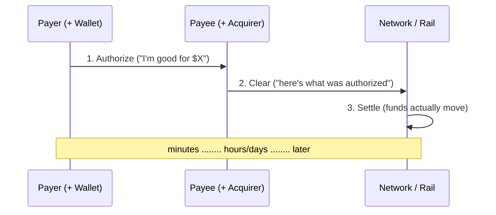

# Tutorial 01 — Introduction to Digital Payments

> **Series:** [AVP-Micro Tutorials](README.md) · **Next:** 02 — Why AI-Agent Payments Are Different
>
> **You'll learn:** what a payment actually *is*, the three phases everyone conflates
> (authorize → clear → settle), how the major rails differ, what "finality" means, and why
> the way AVP-Micro is built mirrors how real money already moves. No prior knowledge assumed.

---

## 1. What is a payment, really?

A payment is the **transfer of value from a payer to a payee, in a way both sides — and
often a third party — agree actually happened.**

That last clause is the hard part. Moving a number from one place to another is trivial.
The difficulty is **agreement under distrust**:

- The payee won't ship the goods until they're confident the money is (or will be) theirs.
- The payer doesn't want to pay for something they don't receive.
- Neither fully trusts the other, and value must not be created or destroyed in transit —
  the same dollar can't be spent twice (the **double-spend problem**).

Every payment system ever built — gold coins, cheques, Visa, Bitcoin — is a different answer
to one question: **who do we trust to say the value moved, and what happens when they're
wrong?**

Hold onto that question. It's the thread through this entire series, and it's exactly what
AVP-Micro re-answers for autonomous software agents.

---

## 2. The cast of characters

A cash payment has two parties. A *digital* payment almost always has more, because the
payer and payee don't share a ledger — their banks do.

| Role | What they do | Real-world example |
|------|--------------|--------------------|
| **Payer** | Initiates / authorizes the payment | You, the cardholder |
| **Payee** | Provides goods/services, receives value | A merchant, an API |
| **Issuer** | The payer's bank; holds their funds, vouches for them | Your card-issuing bank |
| **Acquirer** | The payee's bank; collects funds on their behalf | The merchant's bank/PSP |
| **Network** | Routes messages + nets out who owes whom | Visa, Mastercard, ACH, Lightning |
| **Processor / PSP** | Software glue that talks to the network for a merchant | Stripe, Adyen, PayPal |
| **Wallet** | Holds credentials/keys and authorizes on the payer's behalf | Apple Pay, MetaMask, a PayPal balance |

> **AVP-Micro mapping.** The stack names a smaller, sharper cast: **Principal** (the human/org
> who delegates authority), **Agent** (the software that spends within the rules), **Payee**
> (the service), **Wallet** (verifies everything and enforces policy), and the **Ledger/rail**
> (the only money-touching step). You'll meet them properly in Tutorial 03.

---

## 3. The three phases everyone conflates

The single most useful idea in payments is that a payment is **not one event**. It is three,
and they happen at different times, with different guarantees:



1. **Authorization** — a *promise*. The payer (or their issuer) approves the charge and
   typically *holds* the funds. **No money has moved yet.** A card "approval" at checkout is
   only this step. It can still fail, expire, or be reversed.

2. **Clearing** — *reconciliation*. The transaction details are exchanged between the payee's
   side and the payer's side, batched, and the net amounts each bank owes are computed.

3. **Settlement** — the *actual movement of funds* between the institutions, usually across a
   separate banking rail (often a central-bank system). **This is the only step where value
   truly changes hands.**

Why this matters: most of the "interesting" trust and fraud logic lives in **authorization**,
while the **money** lives in **settlement** — and they are deliberately decoupled so each can
evolve independently.

> **AVP-Micro mirrors this exactly.** The protocol's `authorize` step is a signed promise that
> binds a quote and presents the agent's mandate; **settlement is scoped out of the core** and
> handled by a pluggable rail (Tutorial 09). That separation is *why* the same authorization
> can settle on a blockchain, a card network, or PayPal without changing anything upstream.

---

## 4. Push vs. pull: who reaches into whose account?

Two fundamentally different directions of money movement:

- **Pull payments** — the payee *pulls* funds from the payer's account. **Cards work this
  way:** you hand the merchant a credential (your card number/token) that lets *them* request
  the money. Powerful, but it means the payee holds something that can charge you, which is why
  cards need heavy fraud, tokenization, and **chargeback** machinery.

- **Push payments** — the payer *pushes* funds to the payee. Bank transfers, instant rails
  (FedNow, RTP, SEPA Instant, Interac), crypto sends, and **push-to-card** (Visa Direct,
  Mastercard Send) all work this way. The payer's side initiates an irreversible credit; the
  payee never holds a "charge me" credential.

Push is simpler and safer for the payer but historically slower; instant-payment rails and
push-to-card closed that speed gap. **Agent payments lean push-shaped**: an agent should hold
a *bounded permission to send*, not a reusable credential that anyone can charge.

---

## 5. The rail families

A **rail** is the underlying system that actually carries the value. The families differ in
speed, cost, reversibility, and *who attests that settlement happened*.

| Family | Examples | Direction | Finality | Who attests settlement |
|--------|----------|-----------|----------|------------------------|
| **Card networks** | Visa, Mastercard (acquiring) | Pull (auth/capture) | Slow; reversible for ~months (chargebacks) | Acquirer/processor (Stripe, Adyen) |
| **Push-to-card** | Visa Direct, Mastercard Send | Push (credit, OCT/MoneySend) | Fast; effectively irreversible | The card network |
| **Bank transfer** | ACH, SEPA | Push | 1–3 days; ACH returns possible | The banks |
| **Instant bank** | FedNow, RTP, SEPA Instant, Interac | Push | Seconds; irrevocable | The banks / orchestrator (e.g. Zum Rails) |
| **Wallets** | PayPal, Apple/Google Pay | Varies | Processor-dependent | The wallet provider |
| **Crypto** | Bitcoin, Lightning, EVM stablecoins, x402 | Push | Probabilistic → final by confirmations / preimage | **The chain itself — publicly verifiable** |

Notice the **last column** — it's the crux. On public blockchains, *anyone* can verify
settlement happened by reading the chain. On every traditional rail, you must **trust a private
processor's word** that the funds moved; the proof is an *attestation*, not a public fact.

> **AVP-Micro mapping.** This distinction is built into the settlement bundle as two proof
> shapes: a **`SettlementProof`** for publicly-verifiable on-chain rails (confirmations,
> Lightning preimage), and an **`AttestedSettlementProof`** for closed-processor rails, which
> embeds a processor attestation signed by the payee or the processor and names the processor
> as a `did:web` trust root (e.g. `did:web:visa.com`). Every rail in the table above already
> has a signed, verifiable example in [`spec/settlement/test-vectors/`](../../spec/settlement/test-vectors/).

---

## 6. Finality and risk: when is money *really* moved?

"Did I get paid?" has a surprisingly slippery answer.

- A **card authorization** can be reversed by a **chargeback** weeks or months later. The
  payee bears that risk.
- An **instant bank** credit or a **crypto** transfer past enough confirmations is
  **final** — irreversible by design. Great for the payee; means errors can't be clawed back.
- **Probabilistic finality** (most blockchains): a transaction is "very likely" permanent
  after N confirmations, and certainty grows with each block. Lightning is different again —
  finality is the reveal of a cryptographic **preimage**.

**Finality is a trade-off, not a feature.** Reversibility protects payers from fraud and
mistakes; irreversibility protects payees and enables instant, low-cost transfers. Disputes,
refunds, and chargebacks are the machinery that *manages* irreversibility after the fact.

> **AVP-Micro mapping.** Finality is a first-class, typed value: a settlement proof's
> `finality` is `pending`, `probabilistic`, or `final`, and a wallet **must not** treat a
> payment as done until the rail's finality rule is met (confirmation threshold, preimage, or
> a terminal processor attestation). The reverse value-flow — refunds, reversals, and an
> adversarial dispute lifecycle — is the [disputes bundle](../../spec/disputes/) (Tutorial 11).

---

## 7. Identity, authorization, and trust

Underneath the money flow is a quieter, equally important flow: **who is allowed to do this,
and how do we know?**

- **Authentication** — proving *who* you are (a password, a passkey, a private key).
- **Authorization** — proving you're *allowed* to do this specific thing (spend up to $50 at
  this merchant, today).
- **Mandates / tokens** — a durable, scoped permission. A card-on-file, a direct-debit
  mandate, or an OAuth token are all "you may charge me, within these limits."
- **KYC / AML** — the regulated identity checks institutions must run; the reason real rails
  require licensed intermediaries and the spec **scopes the money-touching step out**.

Traditional systems bind authorization to a *credential the payee holds and reuses* (a card
number, a stored token). That's convenient but fragile: anyone who copies it can charge you,
so the entire industry spends enormous effort on tokenization, 3-D Secure, and fraud scoring.

> **AVP-Micro mapping.** The stack replaces "a reusable credential the payee holds" with a
> **cryptographically signed, bounded, single-use authorization** the *payer's* agent
> produces per payment, presenting a **delegated mandate** (the
> `SpendingAuthorizationCredential`: caps, allow-listed payees, categories, expiry). The payee
> never holds anything that can charge you again. This is Tutorials 04–06.

---

## 8. Where this breaks for AI agents (the motivation)

Now the punch line. Every mechanism above assumes a **human in the loop at the moment of
payment** — tapping a card, approving a push, clicking "pay." Autonomous AI agents break that
assumption in specific ways:

1. **Delegation.** A human must grant an agent *bounded* spending authority in advance — "buy
   compute up to $20/day from these providers" — not hand over a card.
2. **Autonomy at machine speed.** Thousands of tiny payments (per API call, per token) with no
   human to click. Card fees and human approval don't fit.
3. **Verifiability.** When software spends your money, you need a cryptographic, auditable
   trail of *exactly* what was authorized and why — not a bank statement line.
4. **Interoperability.** Two independently-built agents and services must transact without a
   prior relationship or a shared platform.

These gaps are what **AVP-Micro** ("Agent Verifiable Micropayments") exists to fill: a
trust-and-authorization layer that sits *above* the settlement rails you just met, so an agent
can prove it was permitted to pay, a service can verify that proof, and the actual money can
settle on *any* rail — card, bank, wallet, or chain.

That's the subject of **Tutorial 02 — Why AI-Agent Payments Are Different**, which turns each
gap above into a concrete requirement, and **Tutorial 03**, which shows the whole stack
end-to-end.

---

## 9. Recap

- A payment is **value transfer under distrust**; the core problem is *who attests it
  happened, and what if they're wrong.*
- It has three decoupled phases: **authorize** (a promise), **clear** (reconcile), **settle**
  (money actually moves).
- Rails differ by **direction** (push/pull), **finality** (reversible ↔ irreversible), and
  **who attests settlement** (publicly verifiable chain vs. a trusted processor).
- Authorization is increasingly about **scoped, signed mandates** rather than reusable
  credentials — and that's the door AVP-Micro walks through for AI agents.

## Glossary

- **Authorization** — approval/hold of a charge; a promise, not a transfer.
- **Clearing** — reconciliation of transaction details between institutions.
- **Settlement** — the actual movement of funds; the only money-touching step.
- **Finality** — the point at which a payment is irreversible (`pending` / `probabilistic` /
  `final`).
- **Pull payment** — payee draws funds using a credential (cards).
- **Push payment** — payer sends funds (bank transfers, instant rails, push-to-card, crypto).
- **Rail** — the system that carries the value (Visa, ACH, Lightning, EVM…).
- **Issuer / Acquirer** — the payer's bank / the payee's bank.
- **Processor / PSP** — software intermediary to a rail (Stripe, Adyen, PayPal).
- **Chargeback** — a payer-initiated reversal of a (card) payment.
- **Mandate** — a durable, scoped permission to be charged or to spend.
- **Attestation** — a signed statement that something (e.g. settlement) occurred, used when it
  can't be publicly verified.

## Try it (optional, 2 minutes)

You don't need to understand the code yet — just *see* the rails this tutorial described,
already implemented as signed, verifiable objects:

```powershell
# from the repo root, with the venv active
.venv\Scripts\python spec\conformance.py     # lists every behaviour, incl. each settlement rail
ls spec\settlement\test-vectors               # SettlementProof (on-chain) vs AttestedSettlementProof (processor)
```

Each `*-settlement-proof-*.json` is a real, signed example of one of the rails in §5. By the
end of this series you'll be able to read, verify, and produce them yourself.

---

**Next:** Tutorial 02 — *Why AI-Agent Payments Are Different.*
