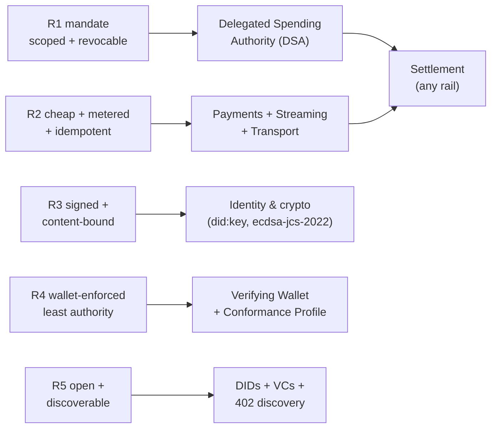

# Tutorial 02 — Why AI-Agent Payments Are Different

> **Series:** [AVP-Micro Tutorials](README.md) · **Previous:** [01 — Introduction to Digital Payments](01-introduction-to-digital-payments.md) · **Next:** 03 — The AVP-Micro Stack at a Glance
>
> **You'll learn:** the specific ways autonomous agents break the assumptions of card and
> wallet payments, each turned into a concrete requirement, plus the threat model those
> requirements answer — and how each one maps to a real, testable protection in this stack.

---

## 1. The assumption that breaks

Tutorial 01 ended on a key observation: **every mainstream payment mechanism assumes a human
is present at the moment of payment** — tapping a card, approving a push, clicking "Pay now."
That human is doing more work than it looks. They are:

- **authorizing** this specific charge (intent),
- **authenticating** themselves (it's really me),
- **applying judgment** (is this amount/merchant reasonable?),
- and serving as the **accountable party** if something goes wrong.

An autonomous AI agent removes the human from that moment. It might make a payment at 3 a.m.,
a thousand times an hour, across services its owner has never heard of. So we cannot simply
"give the agent a card." We have to **reconstruct each of those four human functions in
software, cryptographically, ahead of time** — and bound them so a mistake or a compromise
can't drain the account.

That reconstruction is what makes agent payments a distinct problem. Let's make it precise.

---

## 2. Five properties, five requirements

### 2.1 Delegation, not possession

A human owns the money; the agent only *acts on their behalf, within limits*. The agent must
**never** hold the owner's actual payment credentials (card number, bank login, private keys to
the funds). If it did, a prompt-injection or a leaked log would be a total compromise.

> **Requirement R1 — a scoped, revocable, verifiable mandate.** The owner issues the agent a
> *capability*: "you may spend, but only under these rules." It is cryptographically signed,
> independently verifiable, and revocable — and it grants **permission to request payment**,
> never possession of the funds.

Why existing tools fall short: a **card-on-file** is possession (anyone with it can charge,
unboundedly, until you cancel the card). An **OAuth token** is closer — it's scoped and
revocable — but its scopes are coarse ("payments:write"), it's a bearer secret (whoever holds
it can use it), and it's tied to one provider's platform, not portable across services.

> **In this stack:** the mandate is the `SpendingAuthorizationCredential` (a W3C Verifiable
> Credential). It encodes a currency, a per-transaction cap, a daily limit, an allow-list of
> payees, permitted categories, and a validity window — and it is *presented*, not handed over.
> You'll build one in [Tutorial 05](05-delegated-spending-authority.md).

### 2.2 Autonomy at machine speed — and micro-amounts

Agents transact continuously and in tiny increments: a fraction of a cent per API call, a few
cents per thousand tokens, metered usage that accrues over a session. Two consequences:

- **Per-payment overhead must be near zero.** Card interchange (~30¢ + 2–3%) makes a $0.002
  payment absurd. Human approval per call is impossible.
- **Retries are normal.** Networks are flaky; an agent will resend. The system must make a
  resend *safe* — the same logical payment must not be charged twice.

> **Requirement R2 — cheap, automatic authorization with metering and idempotency.** Support
> sub-cent amounts, streaming/metered sessions with a budget, and an idempotency key so a
> retried request returns the original result instead of double-charging.

> **In this stack:** the quote→authorize→execute→receipt flow is plain signed JSON with no
> per-payment human step ([Tutorial 06](06-the-payment-lifecycle.md)); streaming sessions meter
> usage against a committed budget ([Tutorial 07](07-streaming-and-metered-payments.md)); and the
> transport binding carries an `Idempotency-Key`, returning `409 idempotency-conflict` if a key
> is reused with a different body ([Tutorial 08](08-http-402-transport.md)).

### 2.3 Verifiability and accountability

When *software* spends your money, "trust me" is not acceptable. You need an auditable,
**non-repudiable** record of exactly what was authorized, by whom, for what, under which limits
— and proof that the thing delivered is the thing paid for.

> **Requirement R3 — every step is signed and content-bound.** Each message carries a digital
> signature; each references the previous step by a **content digest**, so the chain
> quote → authorization → execution → receipt cannot be silently altered or recombined. A
> tampered quote, a swapped amount, or a forged approval must be *detectable*, not merely
> discouraged.

This is stronger than a bank statement, which is a single party's after-the-fact summary. Here,
each party signs its own step, and the bindings are verifiable by anyone.

> **In this stack:** every object is signed with `ecdsa-jcs-2022` over its JCS canonical form
> ([Tutorial 04](04-identity-and-cryptography.md)); the authorization carries a `quoteDigest`
> and `requestHash` that bind it to the exact quote and request, and the receipt binds the
> execution. The harness proves tampering breaks the signature (`python spec/verify.py`).

### 2.4 Least authority and containment

An agent will, eventually, be wrong — buggy, jailbroken, or fed a malicious instruction. The
design goal is not "prevent all mistakes" (impossible) but **bound the blast radius**. A
compromised agent should be able to lose, at most, what the mandate allowed — not the account.

> **Requirement R4 — fine-grained, wallet-enforced policy.** Caps, allow-lists, categories,
> expiry, and single-use are enforced by a **verifying wallet** that checks every payment
> against the mandate *before* settling — the agent cannot self-certify. The wallet is the
> policy decision point; the agent is merely the requester.

> **In this stack:** the **Wallet** verifies the mandate chain and refuses anything outside it,
> with specific reasons — `overCap`, `payeeNotAllowed`, `categoryNotAllowed`,
> `dailyLimitExceeded`, `expired`, `nonceReuse` (replay), `missingConfirmation`. Each refusal
> is a normative conformance requirement (Tutorial 13) and a runnable simulator scenario.

### 2.5 Interoperability without a prior relationship

The web's power is that any browser can talk to any server with no prior account. Agent
payments need the same: an agent built by one vendor must pay a service built by another, with
**no shared platform, no pre-provisioned account, no bilateral contract** — discovering how to
pay on the fly.

> **Requirement R5 — open, vendor-neutral, discoverable.** Identities are decentralized (no
> central registrar), messages use open standards (W3C Verifiable Credentials, JSON-LD), and a
> service publishes *how to pay it* at a well-known location so any agent can transact.

> **In this stack:** identities are `did:key` DIDs (no registrar); messages are JSON-LD VCs; a
> payee publishes a `ServiceDescription` at `/.well-known/avp-micro` and the whole exchange runs
> over an HTTP **402 Payment Required** challenge ([Tutorial 08](08-http-402-transport.md)). And
> because authorization is separated from settlement, the *same* payment can settle on any rail
> from Tutorial 01 — chain, card, bank, wallet, or push-to-card.

---

## 3. Two more that matter

Beyond the five core properties:

- **Human-present escalation.** Some actions — a large or sensitive purchase — should require
  *fresh* human approval even under a standing mandate. The system needs a way to demand and
  verify a signed, just-in-time confirmation (refused with `missingConfirmation` / `forgedConfirmation`
  otherwise).
- **Reversibility.** Agents err and merchants disappoint. There must be a path back: refunds,
  reversals, and an adjudicated dispute lifecycle — the reverse value-flow
  ([Tutorial 11](11-refunds-reversals-disputes.md)).

---

## 4. The threat model

Requirements are clearest when you see the attacks they stop. An adversary here might be a
malicious payee, a network attacker, or the agent itself (compromised). The defenses are not
aspirational — each is exercised by a signed test vector and a conformance check.

| Attack | What the adversary tries | Defense | Refusal / check |
|--------|--------------------------|---------|-----------------|
| **Over-spend** | Authorize above the cap or daily limit | Wallet enforces the mandate's `maxPerTransaction` / `dailyLimit` | `overCap`, `dailyLimitExceeded` |
| **Payee substitution** | Redirect funds to an unapproved payee | Allow-list + signed payee in the authorization | `payeeNotAllowed` |
| **Quote tampering** | Alter the price after it was quoted | Authorization binds `quoteDigest` of the exact quote | `quoteMismatch`, `amountMismatch` |
| **Replay** | Resubmit a captured authorization to charge again | Single-use nonce; the wallet consumes it | `nonceReuse` |
| **Replay to another verifier** | Reuse a valid authorization at a different service | The 402 challenge nonce is echoed and bound to *this* verifier | transport `nonce-reuse` |
| **Stale authority** | Use a credential the owner has revoked | Status checked (and re-checked at settlement) | `credentialRevoked` |
| **Forged approval** | Fake a human "yes" for a gated purchase | Confirmation must be signed by the principal | `forgedConfirmation`, `missingConfirmation` |
| **Settlement redirection** | Settle to an account not controlled by the payee | Account binding ties the payee DID to the receiving account | `accountRedirection` |
| **Forged settlement** | Claim funds moved when they didn't | On-chain finality, or a signed processor attestation | `settlementNotFinal`, `settlementMismatch` |

> Every row above is a row in the **Wallet Conformance Profile** and a scenario the simulator
> replays. You can watch them refuse, live, in the demo's **Walk a use case** view or run
> `python spec/conformance.py`.

---

## 5. From requirements to the shape of the stack

Put the requirements together and the architecture almost draws itself:



- A **trust/authorization layer** (mandate, signed lifecycle, wallet enforcement) that is
  **separate from settlement** — exactly the authorize/settle split from Tutorial 01, now made
  cryptographic and agent-driven.
- Built from **open primitives** (DIDs, Verifiable Credentials, JSON-LD, a JCS-canonical
  signature suite) so anyone can implement and verify it.
- With a **conformance profile** so "the wallet enforces the rules" is a *demonstrated* fact,
  not a claim.

That is precisely the six-bundle AVP-Micro stack. **Tutorial 03** walks a single payment
through all of it end to end.

---

## 6. Recap

- Agent payments must reconstruct, in software and ahead of time, the four jobs a human
  normally does at checkout: authorize, authenticate, judge, and be accountable.
- Five properties drive the design: **delegation (not possession), machine-speed/micro-amounts,
  verifiability, least-authority containment, and open interoperability** — plus human-present
  escalation and reversibility.
- The defenses are concrete and testable: a scoped mandate, signed + content-bound messages, a
  verifying wallet that refuses out-of-policy payments, and rail-neutral settlement.

## Glossary

- **Delegation** — granting bounded authority to act on one's behalf without transferring
  ownership or credentials.
- **Mandate / capability** — a signed, scoped, revocable grant of permission (here, the
  `SpendingAuthorizationCredential`).
- **Least authority** — granting the minimum permission needed, so compromise is contained.
- **Idempotency** — a property where retrying an operation yields the same result, never a
  duplicate effect.
- **Non-repudiation** — a signer cannot later deny having authorized what they signed.
- **Content binding / digest** — referencing another object by the hash of its bytes, so any
  change is detectable.
- **Policy decision point** — the component (the wallet) that decides whether a request is
  allowed.

## Try it (optional)

See containment in action — a refusal, with the exact reason, all from real signatures:

```powershell
.venv\Scripts\python spec\conformance.py | findstr /C:"WCP-LIM" /C:"WCP-BND"
```

Each `[PASS]` line is the wallet correctly *refusing* an out-of-policy or tampered payment
(over-cap, wrong payee, replay, quote tampering…). Those refusals are the whole point — they're
what makes delegating spending authority to software safe.

---

**Next:** Tutorial 03 — *The AVP-Micro Stack at a Glance.*
