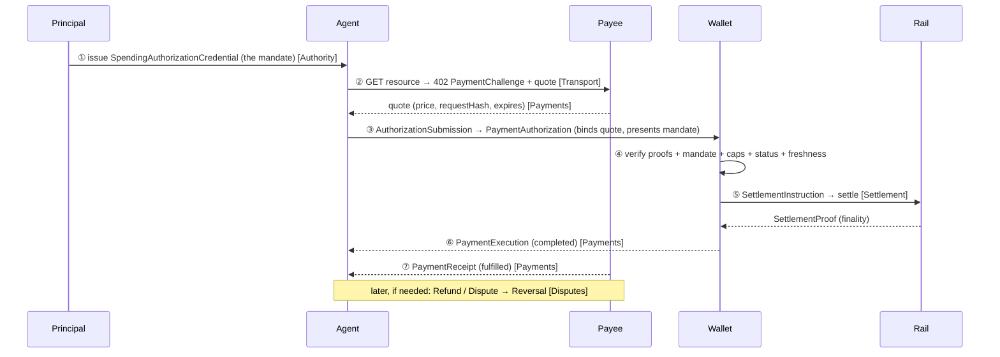

# Tutorial 03 — The AVP-Micro Stack at a Glance

> **Series:** [AVP-Micro Tutorials](README.md) · **Previous:** [02 — Why AI-Agent Payments Are Different](02-why-agent-payments-are-different.md) · **Next:** 04 — Identity & Cryptography
>
> **You'll learn:** the cast of participants, the six peer specifications and what each owns,
> and — most importantly — how a *single* payment flows through all of them end to end.

---

## 1. One grammar, six bundles

AVP-Micro is not one monolithic spec. It's **six peer bundles** that share a single
"credential grammar": every message is a signed JSON-LD object using the same identity model
(`did:key`) and the same signature suite (`ecdsa-jcs-2022`). Each bundle adds its own
vocabulary on top, and they compose by **reference and content digest**, never by copying.

| Bundle | Owns | Namespace |
|--------|------|-----------|
| **Authority (DSA)** | Identity, the spending mandate, the trust framework | `spending-authority/v1#` |
| **Payments** | Quotes, authorizations, executions, receipts, streaming | `avp-micro/v1#` |
| **Transport** | The HTTP wire binding (discovery + 402 challenge) | `avp-micro/transport/v1#` |
| **Settlement** | Binding a payment to a rail (chain / processor) + a proof | `avp-micro/settlement/v1#` |
| **Disputes** | Refunds, reversals, and the dispute lifecycle | `avp-micro/disputes/v1#` |
| **Interop** | Bridging SD-JWT-VC / Google AP2 mandates in and out | `avp-micro/interop/sd-jwt-vc/v1#` |

Authority and Payments are the core; the other four are layers you add as needed.

## 2. The cast

| Participant | Role |
|-------------|------|
| **Principal** | The human/org who owns the money and **issues** the spending mandate. |
| **Agent** | The software that **holds** the mandate and requests payments within it. |
| **Payee** | The service being paid; signs quotes and receipts. |
| **Wallet** | The trust anchor: **verifies** everything, **enforces** policy, **settles**, signs executions. |
| **Arbiter** | Adjudicates a dispute when payer and payee disagree. |
| **Ledger / rail** | Where value actually moves — the one money-touching step the core scopes out. |

The crucial design point from Tutorial 02: the **Agent requests**, the **Wallet decides**. An
agent can never self-approve a payment.

## 3. One payment, end to end

Here is a single one-off payment touching the whole stack:



1. **Issue** — once, the Principal signs a mandate scoping what the Agent may spend (Authority).
2. **Discover & quote** — the Agent hits a gated resource, gets a `402` with a signed
   `PaymentChallenge` wrapping a `PaymentQuote` (Transport + Payments).
3. **Authorize** — the Agent builds a `PaymentAuthorization` that binds the quote by digest and
   *presents* the mandate as a verifiable presentation, wrapped in an `AuthorizationSubmission`.
4. **Verify & enforce** — the Wallet checks every signature, the mandate chain, the caps and
   allow-lists, the credential's status, and the challenge freshness. Out-of-policy → refused.
5. **Settle** — the Wallet emits a `SettlementInstruction` to a rail and gets back a proof
   (Settlement). The rail is pluggable: chain, card, bank, wallet, push-to-card.
6. **Execute** — the Wallet signs a `PaymentExecution` recording the result.
7. **Receipt** — the Payee signs a `PaymentReceipt` acknowledging delivery.
8. **Reverse** (later, if needed) — refunds and disputes flow backward to a `Reversal`
   (Disputes).

Every arrow is a signed object; every later object references the earlier one by **content
digest**, so the whole chain is tamper-evident and independently verifiable.

## 4. Where the requirements live

Mapping Tutorial 02's requirements onto the bundles:

- **R1 mandate** → Authority (`SpendingAuthorizationCredential`, trust framework).
- **R2 cheap/metered/idempotent** → Payments (lifecycle + streaming) + Transport (idempotency).
- **R3 signed + content-bound** → the shared crypto grammar (Tutorial 04) used by all bundles.
- **R4 wallet-enforced least authority** → the Wallet's verification + the Conformance Profile.
- **R5 open + discoverable** → DIDs/VCs everywhere + Transport's `/.well-known` discovery.

## 5. How it's all kept honest

The repo isn't just prose. Four programs keep every claim true (Tutorial 14 runs them):

- `generate.py` — deterministically (re)writes every signed test vector.
- `verify.py` — checks proofs, signer bindings, and the digest links between objects.
- `validate.py` — validates JSON-LD, JSON Schema, SHACL shapes, and the OpenAPI contract.
- `conformance.py` — certifies a wallet against the normative behaviour catalogue.

## 6. Recap

- Six peer bundles, one signed-VC grammar; Authority + Payments are the core, the rest layer on.
- A payment is a *chain* of signed objects, each binding the previous by digest, flowing
  Principal → Agent → Payee → Wallet → rail, with the Wallet as the policy decision point.
- Settlement is deliberately separable, which is why any rail works under the same authorization.

## Glossary

- **Bundle** — one of the six peer specifications (context + vocab + schema + shapes + vectors).
- **Credential grammar** — the shared rules (DIDs, JSON-LD, `ecdsa-jcs-2022`) every object uses.
- **Verifiable Presentation (VP)** — a signed wrapper presenting one or more credentials.
- **Trust anchor** — the party (the Wallet) whose verification everyone relies on.

## Try it

```powershell
.venv\Scripts\python spec\verify.py    # watch the whole signed chain verify, step by step
```

The output walks the same lifecycle this tutorial described — proofs, signer bindings, and the
quote→authorization→execution→receipt digest links — and ends with `PASS`.

---

**Next:** Tutorial 04 — *Identity & Cryptography.*
