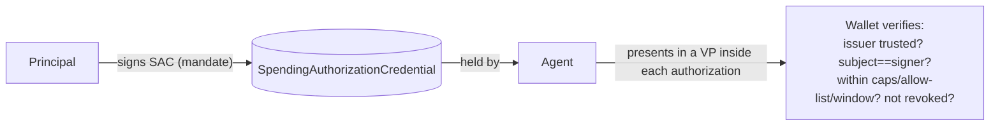

# Tutorial 05 — Delegated Spending Authority

> **Series:** [AVP-Micro Tutorials](README.md) · **Previous:** [04 — Identity & Cryptography](04-identity-and-cryptography.md) · **Next:** 06 — The Payment Lifecycle
>
> **You'll learn:** the mandate at the heart of the stack — the `SpendingAuthorizationCredential`
> — its fields, the trust framework that decides whose mandates a wallet honours, and how the
> mandate is *presented* (not handed over) at payment time.

---

## 1. The mandate

The Delegated Spending Authority (DSA) bundle answers Requirement R1: *delegation, not
possession*. The Principal issues the Agent a **`SpendingAuthorizationCredential` (SAC)** — a
W3C Verifiable Credential that says "this agent may spend my money, under these exact rules."

```json
{
  "@context": ["…/credentials/v2", "…/data-integrity/v2", "…/spending-authority/v1"],
  "type": ["VerifiableCredential", "SpendingAuthorizationCredential"],
  "issuer": "did:key:z…Issuer",            // the Principal
  "validFrom": "2026-03-25T20:00:00Z",
  "validUntil": "2026-06-25T20:00:00Z",
  "credentialStatus": { "type": "BitstringStatusListEntry", … },  // revocable (Tutorial 12)
  "credentialSubject": {
    "id": "did:key:z…Agent",               // the Agent (the holder)
    "currency": "USD",
    "maxPerTransaction": "0.05",
    "dailyLimit": "5.00",
    "allowedPayees": ["did:key:z…Payee"],
    "allowedCategories": ["…optional category IRIs…"]
  },
  "proof": { "cryptosuite": "ecdsa-jcs-2022", … }   // signed by the Principal
}
```

Read it as a sentence: *"Issuer (Principal) authorizes Subject (Agent) to spend USD, at most
0.05 per transaction and 5.00 per day, only to these payees, only in these categories, valid
for this window — and I, the Principal, sign that."*

Key properties:

- **It grants permission, not funds.** Possessing the SAC lets the Agent *request* payments; it
  is never the money or the keys to it.
- **It is bounded.** Every limit is least-authority (Tutorial 02, R4): a compromised agent can
  lose at most what the SAC allowed.
- **It is revocable.** `credentialStatus` points at a status list the Principal can flip
  (Tutorial 12).
- **The subject is the holder.** The Agent's DID is `credentialSubject.id`; at payment time the
  wallet checks that the *signer of the authorization* is that same subject (holder binding).

## 2. The trust framework: whose mandates count?

A valid signature isn't enough — a wallet must also decide it *trusts the issuer*. The DSA
bundle models this with a local **trusted-issuer list**: entries of `TrustedIssuer`, each with
an optional `IssuerScope` bounding what that issuer may delegate (currency, max-per-transaction,
max-daily-total, allowed categories).

The enforcement rule is **"the more restrictive of the two wins"**: the effective limit is the
*minimum* of what the credential grants and what the issuer's scope permits. So even a
correctly-signed SAC can't exceed the ceiling the wallet's trust policy sets for that issuer.
This is how an organization caps what *any* mandate from a given issuer can authorize.

> Trust configuration (`TrustedIssuer` / `IssuerScope`) is **local wallet policy**, not a signed
> wire message — it's how the verifier decides who to believe.

## 3. The other DSA credentials

The bundle defines two supporting credentials:

- **`MerchantCredential`** — vouches for a payee/merchant (e.g., who they are, that they're a
  legitimate counterparty). Lets a wallet apply allow-list/category rules against verified
  merchant attributes rather than bare DIDs.
- **`PaymentCapabilityCredential`** — a wallet-issued statement of what a wallet can do
  (rails/currencies it supports), useful in discovery and matching.

All three share the DSA grammar (signed VCs, `did:key`, `ecdsa-jcs-2022`).

## 4. Presentation, not transfer

At payment time the Agent doesn't send the wallet a copy of the SAC to keep. It **presents** it
inside the authorization as a **Verifiable Presentation** (the `vp` member of the
`PaymentAuthorization`, Tutorial 06). The presentation:

- embeds the issuer-signed SAC, and
- is itself bound to the agent's signing key,

so the wallet can confirm, in one object, *both* that the Principal granted the authority *and*
that the Agent presenting it is the rightful holder. Nothing reusable is left with the payee.



## 5. What the wallet checks

When the SAC arrives (presented in an authorization), the wallet verifies, in order:

1. **Proof** — the SAC's signature verifies and `verificationMethod` is the issuer.
2. **Trust** — the issuer is on the trusted-issuer list; apply the more-restrictive scope.
3. **Holder binding** — `credentialSubject.id` equals the authorization's signer (the payer/agent).
4. **Validity window** — `validFrom ≤ now ≤ validUntil`.
5. **Status** — not revoked (Tutorial 12), re-checked at settlement.
6. **Policy** — amount ≤ `maxPerTransaction`, running total ≤ `dailyLimit`, payee ∈
   `allowedPayees`, category ∈ `allowedCategories`, currency matches.

A failure at any step is a specific refusal (`badCredential`, `holderMismatch`,
`credentialExpired`, `credentialRevoked`, `overCap`, `payeeNotAllowed`, …) — the containment
guarantees of Tutorial 02.

## 6. Recap

- The **`SpendingAuthorizationCredential`** is a signed, bounded, revocable grant of *permission
  to spend* — the cryptographic form of "you may act on my behalf, within these rules."
- A **trust framework** (trusted issuers + scopes, more-restrictive-wins) decides whose mandates
  a wallet honours and caps them further.
- The mandate is **presented in a VP** at payment time, binding both issuer authority and holder
  identity, leaving nothing reusable behind.

## Glossary

- **SAC** — `SpendingAuthorizationCredential`, the spending mandate.
- **Holder binding** — proof that the entity presenting a credential is its subject.
- **Trusted issuer / issuer scope** — local policy naming acceptable issuers and their ceilings.
- **More-restrictive-wins** — effective limit = min(credential grant, issuer scope).
- **MerchantCredential / PaymentCapabilityCredential** — supporting DSA credentials for payees / wallets.

## Try it

```powershell
.venv\Scripts\python -c "import json; d=json.load(open('spec/authority/test-vectors/spending-authorization-credential.json',encoding='utf-8')); s=d['credentialSubject']; print('agent:', s['id']); print('caps:', s['maxPerTransaction'], 'per txn,', s['dailyLimit'], 'per day'); print('payees:', s['allowedPayees'])"
```

That's the exact mandate every payment in the rest of the series is checked against.

---

**Next:** Tutorial 06 — *The Payment Lifecycle.*
