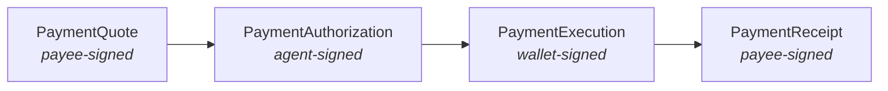

# Tutorial 06 — The Payment Lifecycle

> **Series:** [AVP-Micro Tutorials](README.md) · **Previous:** [05 — Delegated Spending Authority](05-delegated-spending-authority.md) · **Next:** 07 — Streaming & Metered Payments
>
> **You'll learn:** the four signed messages of a one-off payment — quote → authorize → execute
> → receipt — the exact bindings that make the chain safe, and the order in which the wallet
> verifies them.

---

## 1. Four messages, four signers

A single payment is a chain of four signed objects, each from a different signer, each binding
the one before:



There's a fifth, optional first message — the **`PaymentOffer`** — by which a payee advertises
what it sells and how it prices (more in §6).

## 2. Quote — the payee's signed price

The Agent describes what it wants (a request); the Payee returns a **`PaymentQuote`**:

```json
{ "type": "PaymentQuote", "payer": "did:…Agent", "payee": "did:…Payee",
  "requestHash": "sha-256:-DqOvoa…",     // binds the exact request being priced
  "amount": "0.001", "currency": "USD",
  "settlementMethod": "internal-ledger", "settlementTarget": "https://…",
  "expires": "2026-03-25T21:35:00Z", "proof": { … payee signature … } }
```

The `requestHash` ties the price to a specific request, and `expires` bounds how long the price
is valid. It's payee-signed, so the price can't be altered after the fact (R3).

## 3. Authorize — the agent's bound promise

The Agent turns a quote it accepts into a **`PaymentAuthorization`**. This is the pivotal
object: it both **binds the quote** and **presents the mandate**.

```json
{ "type": "PaymentAuthorization", "payer": "did:…Agent", "payee": "did:…Payee",
  "wallet": "did:…Wallet",
  "quoteDigest": "sha-256:EuScAr2qix…",   // = jcs_digest(the quote)  ← Tutorial 04
  "requestHash": "sha-256:-DqOvoa…",      // byte-equal to the quote's
  "amount": "0.001", "currency": "USD",
  "settlementMethod": "internal-ledger", "settlementTarget": "https://…",
  "vp": { … the SpendingAuthorizationCredential, presented … },   ← Tutorial 05
  "timestamp": "2026-03-25T21:31:00Z", "proof": { … agent signature … } }
```

The bindings that matter:

- **`quoteDigest` == `jcs_digest(quote)`** — this authorization is for *that exact quote*; swap
  the quote and the digest mismatches.
- **`requestHash` byte-equal** to the quote's — same underlying request.
- **economic terms equal** — `amount`, `currency`, `settlementMethod`, `settlementTarget` all
  match the quote (no quietly raising the price).
- **`timestamp` < quote `expires`** — the quote hadn't expired when authorized.
- **`vp`** — the embedded, presented mandate the wallet will enforce.

## 4. Execute — the wallet's verified settlement

The Wallet verifies everything (next section), settles on a rail (Tutorial 09), and signs a
**`PaymentExecution`** recording the outcome:

```json
{ "type": "PaymentExecution", "authorization": "urn:avp:authz:999",
  "amount": "0.001", "currency": "USD", "status": "completed",
  "wallet": "did:…Wallet", "proof": { … wallet signature … } }
```

`status` may be `completed`, `partial`, or `failed` (Tutorial 01's settlement outcomes). The
execution references the authorization it fulfils.

## 5. Receipt — the payee's acknowledgement

The Payee signs a **`PaymentReceipt`** acknowledging delivery against the execution:

```json
{ "type": "PaymentReceipt", "quote": "urn:avp:quote:789",
  "execution": "urn:avp:exec:555", "amount": "0.001", "status": "fulfilled",
  "proof": { … payee signature … } }
```

Now the chain is complete and fully cross-referenced: receipt → execution → authorization →
quote, each verifiable by anyone.

## 6. Offers and pricing

Before any of this, a payee may publish a **`PaymentOffer`** describing a service and its
**pricing model**. The Payments bundle supports several, evaluated by `pricing.py`:

- **flat** — a fixed price.
- **per-call** — a price per request.
- **per-unit / tiered** — a rate that varies by quantity bands (e.g., per 1k tokens).
- **composite** — a sum of components across dimensions.

The quote a payee returns is the pricing model evaluated for the specific request.

## 7. The wallet's verification, in order

When the authorization arrives, the Wallet runs (and refuses with a specific code on failure):

1. **Signatures** verify on the authorization and the embedded credential (`badSignature` /
   `badCredential`).
2. **Quote binding** — `quoteDigest` resolves and economic terms match (`quoteMismatch`,
   `amountMismatch`, `currencyMismatch`).
3. **Mandate** — issuer trusted, holder == signer, within window, **not revoked**, within caps
   and allow-lists (Tutorial 05 codes).
4. **Freshness / single-use** — the authorization's nonce hasn't been seen (`nonceReuse`); not
   already settled (`doubleSpend`).
5. **Human-present** (if required) — a valid `PurchaseConfirmation` is present (§8).

Only if all pass does it settle and emit the execution.

## 8. Human-present confirmation

Some charges require *fresh* human approval even under a standing mandate. The Principal signs a
**`PurchaseConfirmation`** (bound to this exact purchase via `confirmedBy` + the request),
which the wallet verifies. Missing or mis-signed → `missingConfirmation` / `forgedConfirmation`.

## 9. Recap

- A one-off payment is four signed objects — **quote (payee) → authorize (agent) → execute
  (wallet) → receipt (payee)** — optionally preceded by an **offer**.
- The **authorization is the keystone**: it binds the quote by digest, repeats the economic
  terms, and presents the mandate.
- The **wallet verifies in a fixed order** and refuses out-of-policy or tampered payments with
  specific, testable reasons.

## Glossary

- **PaymentOffer / PaymentQuote** — advertised pricing / a signed price for a specific request.
- **PaymentAuthorization** — agent-signed promise binding the quote and presenting the mandate.
- **PaymentExecution / PaymentReceipt** — wallet-signed settlement result / payee-signed delivery ack.
- **PurchaseConfirmation** — a principal-signed, just-in-time human approval.
- **requestHash / quoteDigest** — bindings tying the chain to one request and one quote.

## Try it

```powershell
.venv\Scripts\python spec\verify.py | findstr /C:"quote" /C:"authz" /C:"execution" /C:"receipt"
```

Each line is one binding from this tutorial being checked — `quoteDigest` matches, economic
terms equal, the chain links up — on the real signed vectors `00`–`04`.

---

**Next:** Tutorial 07 — *Streaming & Metered Payments.*
