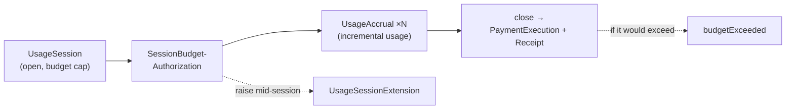

# Tutorial 07 — Streaming & Metered Payments

> **Series:** [AVP-Micro Tutorials](README.md) · **Previous:** [06 — The Payment Lifecycle](06-the-payment-lifecycle.md) · **Next:** 08 — The HTTP 402 Transport Binding
>
> **You'll learn:** how AVP-Micro handles continuous, metered spend — pay-per-token LLM calls,
> usage that accrues over a session — with a committed budget, incremental accruals, and a
> single settlement at close.

---

## 1. Why one-off payments aren't enough

Tutorial 02's Requirement R2 included **machine-speed, micro-amount** spend. Many agent
workloads aren't a single purchase but a *stream*: thousands of tokens from an LLM, seconds of
compute, rows of data — each worth a fraction of a cent. Authorizing and settling each one
individually would drown in overhead.

The Payments bundle solves this with a **session**: authorize a *budget* once, meter usage
against it as it accrues, then settle the **accrued total** a single time at close.



## 2. The session objects

| Object | Signer | Role |
|--------|--------|------|
| **`UsageSession`** | payee | Opens a metered session; declares a `maxAmount` (budget cap) and the meter (e.g. tokens). |
| **`SessionBudgetAuthorization`** | agent | Commits the agent (under its mandate) to a budget for the session; binds the session by digest. |
| **`UsageAccrual`** | payee | Reports incremental usage so far — a meter reading and the amount accrued. |
| **`UsageSessionExtension`** | agent | Raises the budget cap (or expiry) mid-session. |
| **`PaymentExecution` / `PaymentReceipt`** | wallet / payee | At close: settle the accrued total and acknowledge. |

The session reuses the same crypto grammar and binds to the same mandate: the
`SessionBudgetAuthorization` is checked against the SAC's caps just like a one-off authorization
(R4 still holds — the wallet enforces the budget).

## 3. How metering works

1. **Open** — the payee signs a `UsageSession` with a `maxAmount` cap and a meter type/unit
   (e.g. tokens). Think of it as "you may run a tab up to this much."
2. **Commit** — the agent signs a `SessionBudgetAuthorization` binding that session (by digest)
   and committing to the budget under its mandate.
3. **Accrue** — as work happens, the payee signs `UsageAccrual` objects: a cumulative
   `meterReading` (e.g. 12,400 tokens) and the `amountAccrued` so far. The wallet tracks the
   running total against the committed budget.
4. **Enforce** — an accrual (or close) that would push the total past the committed budget is
   refused with **`budgetExceeded`**. The agent must either stop or extend.
5. **Extend** (optional) — the agent signs a `UsageSessionExtension` to raise the cap mid-flight
   (still bounded by the mandate). Settlement then covers the larger total.
6. **Close** — the wallet settles the **accrued total once** (one `PaymentExecution`), and the
   payee signs a session `PaymentReceipt`.

The net effect: one authorization decision and one settlement for potentially millions of tiny
units of work — exactly the overhead profile micro-payments need.

## 4. Pay-per-token, concretely

For an LLM call billed per 1,000 tokens, the meter unit is tokens and the price comes from the
offer's **tiered** pricing model (Tutorial 06 §6, via `pricing.py`). Accruals carry the running
token count; the demo shows a **live budget gauge** climbing toward the cap as tokens accrue,
and the close settles the metered cost.

## 5. Where it shows up downstream

- **Transport** (Tutorial 08) exposes session endpoints: `POST /session`,
  `/session/{id}/budget`, `GET /session/{id}/accruals`, `/session/{id}/extend`,
  `/session/{id}/close`.
- **Conformance** (Tutorial 13) certifies the streaming behaviours: happy path, budget-exceeded
  refusal, mid-session extension, token-usage and general metered sessions.

## 6. Recap

- A **session** authorizes a budget once, meters usage with incremental **accruals**, and
  settles the **accrued total** a single time at close.
- The wallet enforces the **committed budget** (refusing `budgetExceeded`) just as it enforces a
  one-off cap; the agent can **extend** within its mandate.
- This is the overhead profile that makes pay-per-token / metered agent spend viable.

## Glossary

- **UsageSession** — payee-signed opening of a metered session with a budget cap.
- **SessionBudgetAuthorization** — agent-signed commitment to a session budget.
- **UsageAccrual** — payee-signed incremental usage report (meter reading + amount).
- **UsageSessionExtension** — agent-signed mid-session budget/expiry increase.
- **Meter / accrued total** — the unit of usage / the cumulative amount to settle at close.

## Try it

```powershell
.venv\Scripts\python spec\conformance.py | findstr /C:"WCP-STR"
```

Each `[PASS]` is a streaming behaviour certified on the real engine — happy path, the
`budgetExceeded` refusal, extension, pay-per-token, and a metered session.

---

**Next:** Tutorial 08 — *The HTTP 402 Transport Binding.*
