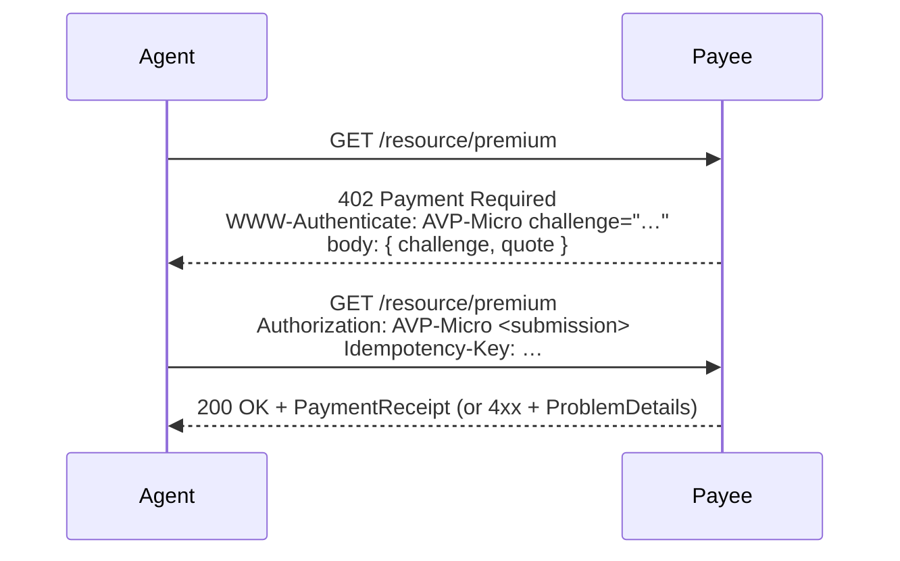

# Tutorial 08 — The HTTP 402 Transport Binding

> **Series:** [AVP-Micro Tutorials](README.md) · **Previous:** [07 — Streaming & Metered Payments](07-streaming-and-metered-payments.md) · **Next:** 09 — Settlement & the Rails
>
> **You'll learn:** how the signed payment objects actually travel between an agent and a
> service over HTTP — discovery, the **402 "Payment Required"** challenge, idempotency, signed
> errors, and the anti-replay rules — so two independent implementations can interoperate.

---

## 1. The wire layer

The other bundles define *messages*. Transport defines the *wire*: how an agent and a payee
discover each other and run the offer→quote→authorize→execute→settle→receipt flow over HTTP.
This is what makes Requirement R5 (open, discoverable interoperability) real — and it reuses
the web's own "payment required" status code, **HTTP 402**.

Namespace: `avp-micro/transport/v1#` (prefix `txp:`). Media type:
`application/avp-micro+json` (errors: `application/problem+json`). Four object types plus an
error vocabulary and an OpenAPI 3.1 contract.

## 2. Discovery

A payee publishes a payee-signed **`ServiceDescription`** at a well-known location:

```
GET /.well-known/avp-micro  →  200  ServiceDescription
```

It advertises the `endpoints` (quote, authorize, execute, receipt, settlementStatus, the
session endpoints), the `acceptedCredentialIssuers`, the `acceptedSettlementRails`, and the
`supportedBundles` and versions. An agent fetches it once and knows how to transact — no prior
account.

## 3. The 402 challenge flow



1. The agent requests a gated resource.
2. The payee replies **`402`** with `WWW-Authenticate: AVP-Micro` and a body that is a
   **`PaymentChallenge`** wrapping the **`PaymentQuote`** — the 402 envelope `{ challenge, quote }`.
   The challenge carries `quoteDigest` (= digest of the quote), a server-chosen **`challenge`
   nonce**, and an `expires`.
3. The agent verifies the quote, builds a `PaymentAuthorization` (Tutorial 06), and wraps it in
   an **`AuthorizationSubmission`** that **echoes the challenge nonce**, references the
   authorization by IRI + `authorizationDigest`, and carries an `idempotencyKey`.
4. The agent retries with `Authorization: AVP-Micro <submission>` and an `Idempotency-Key`.
5. The payee/wallet verifies (quote binding, mandate, challenge freshness, idempotency), settles,
   and returns `200` + receipt — or a `4xx`/`402` with a `ProblemDetails`.

> **The echoed challenge is the anti-replay keystone.** It binds the submission to *this*
> verifier and *this* 402, so a captured authorization can't be replayed to a different service
> (the gap Tutorial 02's threat model called "replay to another verifier").

## 4. Anti-replay & freshness (normative)

- The `challenge` nonce is **single-use**. The payee persists consumed nonces until `expires`
  and refuses a re-presented nonce with **`409 nonce-reuse`**.
- A challenge past its `expires` → **`422 challenge-expired`**.
- A small clock-skew leeway (RECOMMENDED ≤ 60 s) is allowed.
- The `WWW-Authenticate` header carries RFC 7235 parameters: `challenge="…"` on the 402, and
  `error="<code>"` on a failed retry.

## 5. Idempotency

Networks are flaky and agents retry. The `Idempotency-Key` (header, mirrored in the
submission) makes retries safe: the payee MUST return the **same** execution/receipt for a
repeated key, and MUST return **`409 idempotency-conflict`** if the same key is reused with a
*different* body. No accidental double-charge.

## 6. The error model

Every non-success response is an RFC 9457 **`ProblemDetails`** whose `type` is an error-code
IRI from the **`txp:ErrorScheme`** SKOS vocabulary (19 codes: `over-cap`, `payee-not-allowed`,
`amount-mismatch`, `expired`, `nonce-reuse`, `idempotency-conflict`, `credential-revoked`,
`settlement-pending`, …), mapped to HTTP status (402/400/401/403/409/422/5xx). Errors **may be
signed** — `ProblemDetails` allows an optional `proof`, so a `402`/`409` can be authenticated
against the payee, defeating a man-in-the-middle injecting a spurious rejection.

## 7. Explicit, streaming, and async flows

The same binding covers more than the 402 dance:

- **Explicit / programmatic:** `POST /quote` → `POST /authorize` → `GET /receipt/{id}`.
- **Streaming:** `POST /session`, `/session/{id}/budget`, `GET /session/{id}/accruals`,
  `/session/{id}/extend`, `/session/{id}/close` (Tutorial 07).
- **Async settlement:** when settlement isn't instant, `execute` returns a pending
  `PaymentExecution` + a `Location: /settlement/{id}`; the agent polls until the
  `SettlementProof` is final (Tutorial 09).

An **OpenAPI 3.1** document is the machine-readable contract, and the harness cross-checks that
every example exchange conforms to it (so the contract and the examples can't drift).

## 8. Recap

- Transport runs the whole flow over HTTP using an **HTTP 402** challenge, with discovery at
  `/.well-known/avp-micro`.
- The 402 body is `{ PaymentChallenge, PaymentQuote }`; the retry is an `AuthorizationSubmission`
  that **echoes the challenge nonce** (anti-replay) and carries an idempotency key.
- Errors are RFC 9457 `ProblemDetails` (optionally signed) drawn from a SKOS error scheme, and
  an OpenAPI contract pins the whole surface.

## Glossary

- **402 envelope** — the `{ challenge, quote }` body of an HTTP 402 response.
- **ServiceDescription** — the payee-signed discovery document at `/.well-known/avp-micro`.
- **PaymentChallenge / AuthorizationSubmission** — the 402 body / the signed retry payload.
- **Challenge nonce** — single-use anti-replay value the client must echo.
- **Idempotency-Key** — header making retries safe against double-charge.
- **ProblemDetails** — RFC 9457 error body; `type` ∈ `txp:ErrorScheme`; optionally signed.

## Try it

```powershell
.venv\Scripts\python ..\avp-micro-sim-demo\server.py   # a real local payee+wallet, http://localhost:8402
# in another shell:
curl -i "http://localhost:8402/resource/premium?amount=1.00&cap=5.00&payee=allowed"                                  # -> 402 + challenge
curl -i "http://localhost:8402/resource/premium?amount=1.00&cap=5.00&payee=allowed" -H "Authorization: AVP-Micro x"  # -> 200
curl -i "http://localhost:8402/resource/premium?amount=1.00&cap=5.00&payee=allowed" -H "Authorization: AVP-Micro x"  # -> 409 nonce-reuse
```

You'll see the 402 challenge, a successful authorized retry, and the single-use nonce refuse the
replay — over real HTTP with real signatures. (Also in the demo's **Transport** and **Live**
views.)

---

**Next:** Tutorial 09 — *Settlement & the Rails.*
