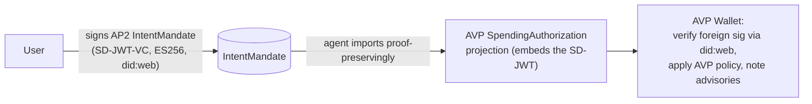

# Tutorial 10 — Interop: SD-JWT-VC & AP2

> **Series:** [AVP-Micro Tutorials](README.md) · **Previous:** [09 — Settlement & the Rails](09-settlement.md) · **Next:** 11 — Refunds, Reversals & Disputes
>
> **You'll learn:** how AVP-Micro bridges to the wider verifiable-credential world — importing
> SD-JWT-VC mandates (Mastercard/Google Verifiable Intent, Google AP2 IntentMandate) as native
> authority, the three bridge modes, and how authority stays rooted in the user, never the bridge.

---

## 1. Why a bridge

AVP-Micro doesn't want to be an island. Other ecosystems already issue agent-payment mandates
in a different format — **SD-JWT-VC** (Selective-Disclosure JWT Verifiable Credentials), used by
Mastercard/Google **Verifiable Intent** and **Google AP2 IntentMandate**. The Interop bundle
lets an AVP-Micro wallet **accept those foreign mandates as delegated authority** (and, the
other direction, present AVP-Micro objects into SD-JWT-VC stacks).

Namespace: `avp-micro/interop/sd-jwt-vc/v1#` (prefix `iop:`). The machinery lives in
`interop.py` (the translator) and `sdjwt.py` (ES256 / SD-JWT primitives).

## 2. A 30-second SD-JWT-VC primer

An **SD-JWT** is a JWT plus a set of **disclosures** — salted hashes in the JWT body whose
plaintext values are sent separately, so the holder can reveal claims *selectively*. A **key-binding
JWT (KB-JWT)** signed by the holder proves possession at presentation time. SD-JWT-VCs are signed
with **ES256** (P-256 / JOSE), and issuers are typically resolved by **`did:web`**.

That's a different shape from AVP-Micro's JSON-LD + `ecdsa-jcs-2022`, which is exactly what the
bridge reconciles.

## 3. The three bridge modes

When importing a foreign mandate into a `SpendingAuthorizationCredential` projection, the bridge
records *how* it was secured, in a `securing` descriptor with a `mode`:

| Mode | What it means | Trust root |
|------|---------------|-----------|
| **proof-preserving** | The original foreign signature is **embedded** and verified in its own stack; the AVP projection is an unsigned *view*. | the original foreign issuer |
| **co-issued** | The same key signs **both** an SD-JWT and an AVP `ecdsa-jcs-2022` proof. | the (single) issuer key, presented two ways |
| **attested** | A **bridge** re-issues the mandate under its own signature, *attesting* to the import. | the attesting bridge (must be explicitly trusted) |

The golden rule across all three: **authority roots in the user/issuer DID, never in the
bridge.** A proof-preserving import carries no AVP proof of its own (it would be misleading);
an attested import is only honoured if the wallet's policy explicitly trusts that bridge — a
crypto-valid attestation from an *untrusted* bridge is still refused.

## 4. Claim mapping and lossy imports

The translator maps foreign claims to AVP terms: issuer→issuer, subject/`cnf`→holder, spending
limits→`maxPerTransaction`/`dailyLimit`, allowed payees, currency, validity (`nbf`/`exp`),
`requires_user_confirmation`→human-present, and AP2 **intent** descriptions.

Some foreign expressiveness has no exact AVP equivalent (e.g. AP2's free-form item intent, or a
*partial* selective disclosure that only reveals a subset). Rather than silently dropping it,
the bridge surfaces an **`importAdvisory`** — an explicit, signed note that the import is lossy
or that granularity was lost (e.g. "M2 granularity loss," "subset view," "no fresh human
approval present"). The wallet sees *exactly* what couldn't be carried over.

## 5. Cross-stack verification

A wallet verifying an imported mandate does **stack-appropriate** checks:

- **proof-preserving / co-issued:** verify the embedded **ES256** SD-JWT against the foreign
  issuer's `did:web` key (resolved via a local resolver), check the KB-JWT (`sd_hash` binds it to
  the right mandate; a stale/replayed nonce is rejected), then apply normal AVP policy.
- **attested:** verify the bridge's `ecdsa-jcs-2022` re-signature **and** that the bridge is
  trusted, with **no-widening** — the re-issued mandate may not grant more than the original.

The harness proves the adversarial cases fail: a tampered embedded chain, a swapped issuer
(unresolvable `did:web`), a tampered or re-bound KB-JWT, and a widened attested re-issue are all
rejected.

## 6. The AP2 path, concretely

For **Google AP2**, the user issues an **IntentMandate** as an SD-JWT-VC (ES256, `did:web` user
issuer). The agent imports it **proof-preservingly** into an AVP `SpendingAuthorizationCredential`
projection; the wallet verifies it via the embedded foreign signature + `did:web` resolver and
then runs the standard payment lifecycle (Tutorial 06) against it — settling within the imported
limits, surfacing any `importAdvisory`, and honouring `requires_user_confirmation`.



## 7. Recap

- The Interop bundle bridges **SD-JWT-VC / AP2** mandates into AVP-Micro as native delegated
  authority (and back out).
- Three modes — **proof-preserving, co-issued, attested** — each with a clear trust root;
  **authority always roots in the user/issuer, never the bridge**, and attested imports require
  explicit bridge trust + no widening.
- Lossy translation is made explicit via **`importAdvisory`**, and cross-stack verification
  checks the foreign ES256 signature, KB-JWT binding, and AVP policy together.

## Glossary

- **SD-JWT-VC** — Selective-Disclosure JWT Verifiable Credential (ES256/JOSE, `did:web` issuers).
- **KB-JWT** — key-binding JWT proving holder possession at presentation.
- **Verifiable Intent / AP2 IntentMandate** — foreign agent-payment mandate formats.
- **Bridge mode** — `proof-preserving` / `co-issued` / `attested`.
- **importAdvisory** — an explicit note that an import was lossy or lower-granularity.
- **No-widening** — an attested re-issue may not grant more than the original.

## Try it

```powershell
.venv\Scripts\python spec\verify.py | findstr /C:"import" /C:"attested" /C:"KB-JWT" /C:"intent"
```

These lines verify the imported mandates and prove the adversarial cases (tampered chain,
swapped issuer, re-bound KB-JWT, widened attestation) are rejected.

---

**Next:** Tutorial 11 — *Refunds, Reversals & Disputes.*
