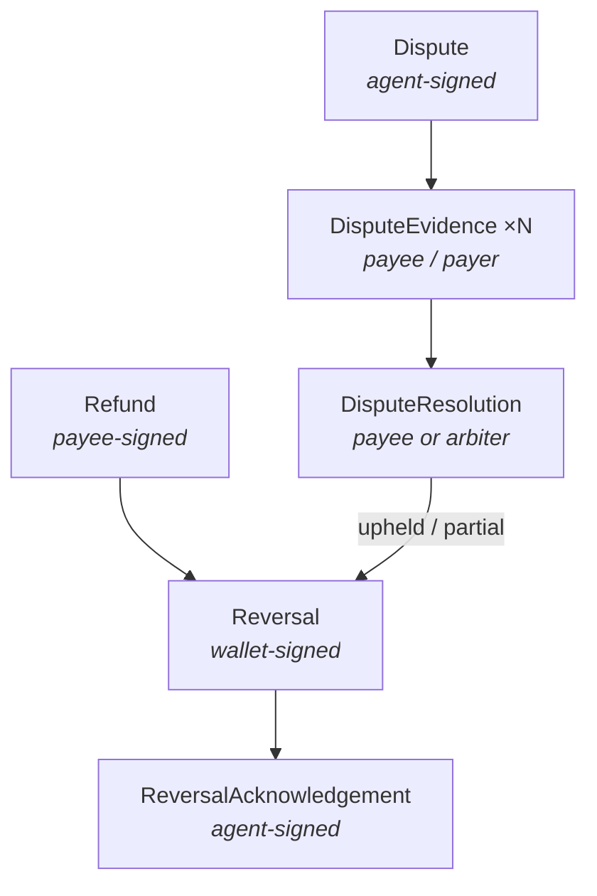

# Tutorial 11 — Refunds, Reversals & Disputes

> **Series:** [AVP-Micro Tutorials](README.md) · **Previous:** [10 — Interop: SD-JWT-VC & AP2](10-interop.md) · **Next:** 12 — Revocation & Status
>
> **You'll learn:** the reverse value-flow — voluntary refunds and the adversarial dispute
> lifecycle — and how both converge on a single wallet-signed `Reversal` that moves money back.

---

## 1. Money sometimes has to come back

Tutorials 06–09 moved value *forward*. But agents err and merchants disappoint, so Requirement
"reversibility" (Tutorial 02) needs a *backward* path. The Disputes bundle defines two of them:

1. **Voluntary refund** — the payee simply gives money back (goodwill, partial, or full).
2. **Adversarial dispute** — payer and payee disagree; an **arbiter** decides; if upheld, a
   **chargeback** reverses the charge.

Both converge on the same terminal object: a **wallet-signed `Reversal`** (plus the payee's
`ReversalAcknowledgement`). Namespace: `avp-micro/disputes/v1#` (prefix `disp:`).



## 2. Voluntary refunds

A **`Refund`** is payee-signed and binds the original payment by digest: it carries the
`receiptDigest`/`execution`, the amount, currency, and a **reason** (from a SKOS reason scheme —
`disp:goodwill`, `disp:not-delivered`, `disp:quality`, …). On the play ledger the money moves
payee → payer.

The one hard rule: **you can't refund more than was settled.** A refund (or the sum of partial
refunds) exceeding the original amount is refused with **`overRefund`**. A refund may be full or
partial; a `Reversal` then records the value movement on the rail.

## 3. The dispute lifecycle

When the parties disagree, the flow is adversarial and signed at every step:

1. **`Dispute`** (agent-signed) — raises a contest over an execution/receipt, naming the
   `disputedAmount`, a `reason`, a `claim`, and (optionally) an `arbiter`.
2. **`DisputeEvidence`** (payee and/or payer) — each side submits sequenced evidence, binding
   the dispute by digest.
3. **`DisputeResolution`** — the decision, with an `outcome` (`upheld`, `partial`, `rejected`,
   `withdrawn`) and a `resolvedAmount`. It is signed by the **payee** (they concede) or by an
   **arbiter** (they adjudicate). An arbiter resolution **supersedes** a prior payee one (it
   binds `supersedesDigest`).

The bundle's shapes enforce the logic, e.g.: a `rejected`/`withdrawn` resolution must have a
zero `resolvedAmount`; an `upheld` one must be non-zero; an arbiter resolution must reference
what it supersedes.

## 4. Chargeback: dispute → reversal

A **`Reversal`** is the wallet-signed object that actually moves money back. It has two causes:

- **`refund`** — the value already moved (the `Refund` did it); the reversal *records* it,
  binding `refundDigest`.
- **`dispute`** — a chargeback. This is only valid if there is an **upheld (or partial)
  `DisputeResolution`** to charge back against; otherwise the wallet refuses with
  **`noReversalBasis`**. The reversal binds the `resolutionDigest` and moves the
  `resolvedAmount`.

The cause and the bound object must match (you can't claim a `dispute` cause while pointing at a
refund). Finally, the agent signs a **`ReversalAcknowledgement`** closing the loop.

On a real rail, the reversal is itself a settlement — a compensating transfer with payer/payee
swapped (Tutorial 09 §6).

## 5. The outcomes, at a glance

| Scenario | Path | Result |
|----------|------|--------|
| Goodwill / partial refund | `Refund` → `Reversal(cause=refund)` | money back, recorded |
| Over-refund attempt | `Refund` (too large) | refused `overRefund` |
| Dispute upheld | `Dispute` → evidence → `DisputeResolution(upheld, arbiter)` → `Reversal(cause=dispute)` | chargeback |
| Dispute rejected | resolution `rejected` (zero amount) | no reversal; `noReversalBasis` if attempted |
| Dispute withdrawn | resolution `withdrawn` (zero amount) | no value movement |

## 6. Recap

- The reverse value-flow has two entries — **voluntary refund** and **adversarial dispute** —
  both converging on a **wallet-signed `Reversal`** (+ agent `ReversalAcknowledgement`).
- Every step is signed and **binds the prior object by digest**; an arbiter resolution
  **supersedes** a payee one.
- Invariants are enforced: no over-refund, no chargeback without an upheld resolution, zero
  amount for rejected/withdrawn outcomes.

## Glossary

- **Refund** — payee-signed return of funds, with a reason; bounded by the settled amount.
- **Dispute / DisputeEvidence / DisputeResolution** — the contest, the submissions, the decision.
- **Arbiter** — third party who adjudicates and whose resolution supersedes the payee's.
- **Reversal / ReversalAcknowledgement** — wallet-signed money-movement-back / agent's ack.
- **Chargeback** — a reversal whose cause is an upheld dispute.

## Try it

```powershell
.venv\Scripts\python spec\conformance.py | findstr /C:"WCP-DIS"
```

These certify the lifecycle on the real engine: full/partial refund, the `overRefund` refusal, a
dispute upheld → chargeback, and rejected/withdrawn outcomes.

---

**Next:** Tutorial 12 — *Revocation & Status.*
