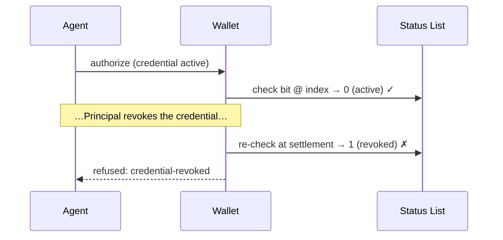

# Tutorial 12 — Revocation & Status

> **Series:** [AVP-Micro Tutorials](README.md) · **Previous:** [11 — Refunds, Reversals & Disputes](11-refunds-reversals-disputes.md) · **Next:** 13 — Conformance
>
> **You'll learn:** how a Principal revokes a mandate after issuing it, how status is encoded as
> a W3C Bitstring Status List, and the operational rules — freshness and re-check-before-settle —
> that stop a revoked credential from sneaking a payment through.

---

## 1. Issuance isn't forever

A `SpendingAuthorizationCredential` has a validity window, but a Principal often needs to pull
authority *before* it expires — the agent is compromised, the project ended, the budget changed.
That's **revocation**, and it's a first-class part of the trust model (Requirement R4,
containment: you must be able to cut a mandate off).

Every SAC carries a **`credentialStatus`** pointer (Tutorial 05):

```json
"credentialStatus": {
  "type": "BitstringStatusListEntry",
  "statusPurpose": "revocation",
  "statusListIndex": "94567",
  "statusListCredential": "https://issuer.example/status/3"
}
```

It says: "my revocation bit is index **94567** in the status list at that URL."

## 2. The Bitstring Status List

AVP-Micro uses the **W3C Bitstring Status List v1.0**. The status list is itself a signed
credential — a **`BitstringStatusListCredential`** — whose `credentialSubject` holds an
`encodedList`: a long bitstring (≥ 131,072 bits / 16 KB minimum, for herd privacy),
GZIP-compressed and base64url-encoded with a multibase `u` prefix.

- Each credential occupies **one bit**, at its `statusListIndex`.
- **bit = 0** → active; **bit = 1** → revoked (for the `statusPurpose`).
- To check a credential, the verifier fetches the list, decodes the bitstring, and reads the bit
  at the index.

Because the list is a fixed large size regardless of how many credentials are actually revoked,
checking one credential's status doesn't leak how many others are revoked, or which.

> In code: `status.py` builds and reads it deterministically — `encode_status_list(revoked_set)`
> (GZIP with a fixed mtime so the signed vector is byte-stable) and `is_revoked(encoded, index)`.

## 3. The status list is a credential too

A status list isn't a bare file you trust blindly — it's issuer-signed. The verifier **must**:

- verify the `BitstringStatusListCredential`'s own `ecdsa-jcs-2022` proof, and
- confirm its issuer is the same authority (or a delegate trusted for status)

before believing any bit. A forged or tampered status list fails verification.

## 4. The operational rules (this is the new part)

Modelling revocation is easy; getting the *timing* right is where real systems leak. The bundle
pins three normative rules:

1. **Check before settling.** A verifier **MUST** resolve `credentialStatus` and reject a
   revoked credential — not just at authorization, but as a gate on settlement.
2. **Status freshness.** The status list carries `validFrom`/`validUntil`. A verifier **MUST**
   reject a list outside its window and **SHOULD** refetch a list older than a deployment-defined
   max age rather than trust a stale cached copy. (A stale cache is how a "revoked" credential
   keeps working.)
3. **Re-check before settlement (revoked mid-flight).** A credential can be revoked *between*
   authorization and settlement. The wallet **MUST** re-check status at settlement time; a
   credential whose bit is set at settlement is refused — surfaced over the transport binding as
   **`credential-revoked`** — even though it was active when the authorization was signed.



## 5. What the harness demonstrates

The repo ships **two** status-list vectors — an **active** list (every bit 0) and a **revoked**
list (the agent's index set), published *after* the authorization to model the mid-flight case.
`verify.py` checks: both lists' proofs verify and are issuer-signed; the active list is the one
the credential points to; the bit reads **0** in the active list and **1** in the revoked list;
the freshness window is well-formed; and the revocation was published after the authorization.

## 6. Recap

- A SAC's `credentialStatus` points at one **bit** in a signed **Bitstring Status List**;
  bit 1 = revoked.
- The status list is **itself a credential** whose proof and issuer the verifier must check.
- The rules that make revocation actually bite: **check before settle, status freshness, and
  re-check at settlement** so a credential revoked mid-flight is refused (`credential-revoked`).

## Glossary

- **Revocation** — invalidating a credential before its `validUntil`.
- **credentialStatus / BitstringStatusListEntry** — the pointer to a credential's status bit.
- **BitstringStatusListCredential** — the signed list; `encodedList` = GZIP+base64url bitstring.
- **statusListIndex** — the bit position for a given credential.
- **Freshness** — only trusting a status list within its validity window / max age.
- **Revoked mid-flight** — revoked between authorization and settlement; caught by re-check.

## Try it

```powershell
.venv\Scripts\python -c "import sys; sys.path.insert(0,'spec'); import json, status as stx; act=json.load(open('spec/authority/test-vectors/status-list-active.json',encoding='utf-8')); rev=json.load(open('spec/authority/test-vectors/status-list-revoked.json',encoding='utf-8')); i=94567; print('active   bit:', stx.is_revoked(act['credentialSubject']['encodedList'], i)); print('revoked  bit:', stx.is_revoked(rev['credentialSubject']['encodedList'], i))"
```

You'll see the same credential read **active** in one list and **revoked** in the other — the
mid-flight transition the wallet must catch.

---

**Next:** Tutorial 13 — *Conformance.*
